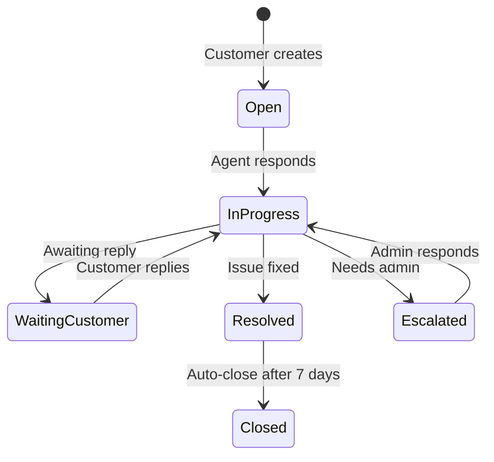

# Support Queue

## Ticket Management

### Status Flow

```mermaid
stateDiagram-v2
    [*] --> Open: Customer creates
    Open --> InProgress: Agent responds
    InProgress --> WaitingCustomer: Awaiting reply
    WaitingCustomer --> InProgress: Customer replies
    InProgress --> Resolved: Issue fixed
    Resolved --> Closed: Auto-close after 7 days
    InProgress --> Escalated: Needs admin
    Escalated --> InProgress: Admin responds
```

### Ticket Actions

- Reply
- Change status
- Assign to agent
- Escalate
- Add internal note
- Link to booking
