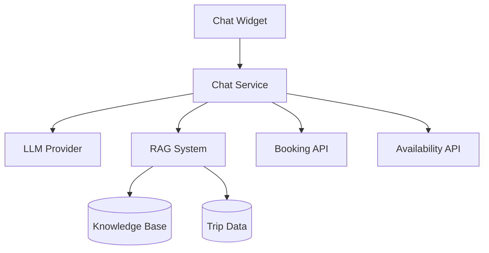

# AI & Chat Design

This section covers the AI-powered chat assistant design.

---

## Contents

| Document | Description |
|----------|-------------|
| [Assistant Design](assistant.md) | AI assistant architecture |
| [Prompt Engineering](prompts.md) | Prompt templates |
| [Integration](integration.md) | Chat widget integration |
| [Knowledge Base](knowledge-base.md) | FAQ and trip data |

---

## Overview

The AI Chat Assistant helps customers with:

- Trip recommendations based on preferences
- Booking assistance and FAQs
- Date and availability inquiries
- Itinerary customization
- General Egypt travel questions

---

## Architecture

