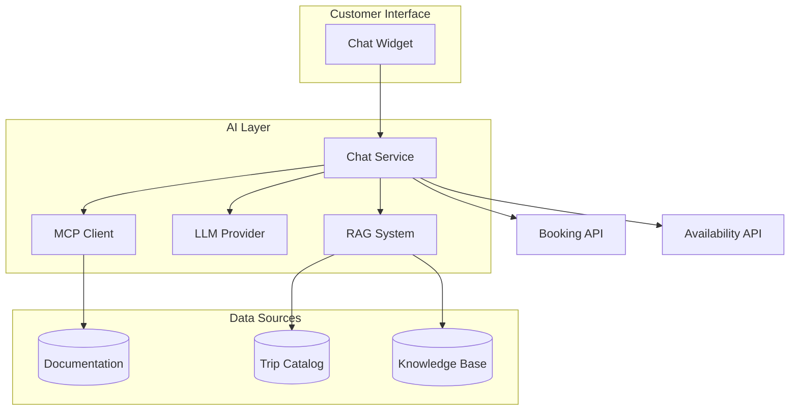

# AI & Chat Design

Comprehensive documentation for the AI-powered chat assistant and MCP integration.

---

## Overview

The Egypt Tours Platform includes an AI-powered travel assistant with:

- **Documentation-Driven Development** via MCP integration
- **RAG-based responses** grounded in trip data and FAQs
- **Anti-hallucination guardrails** ensuring accuracy
- **Multilingual support** (English, Spanish, Arabic)

---

## Documentation

| Document | Description |
|----------|-------------|
| [System Design](system-design.md) | MCP-enabled architecture |
| [MCP Tools](mcp-tools.md) | Tool schema definitions |
| [RAG Strategy](rag-strategy.md) | Retrieval and indexing |
| [Guardrails](guardrails.md) | Safety and accuracy rules |
| [Conversation Flows](conversation-flows.md) | Workflow patterns |
| [Assistant Design](assistant.md) | Chat assistant persona |
| [Prompt Engineering](prompts.md) | System prompts and templates |
| [Integration](integration.md) | Chat widget setup |
| [Knowledge Base](knowledge-base.md) | FAQ and trip data |

---

## Architecture



---

## Key Principles

### 1. Documentation as Source of Truth

All AI responses and generated code must trace to documentation:

```
User Request → MCP Query → Documentation → Cited Response
```

### 2. Zero Hallucination

- Never invent features, prices, or availability
- Always cite documentation sources
- Report gaps instead of guessing

### 3. Multilingual Support

| Language | Code | RTL |
|----------|------|-----|
| English | `en` | No  |
| Spanish | `es` | No  |
| Arabic  | `ar` | Yes |

---

## Quick Links

- **For Developers**: Start with [MCP Tools](mcp-tools.md) and [System Design](system-design.md)
- **For Product**: Review [Guardrails](guardrails.md) and [Conversation Flows](conversation-flows.md)
- **For Integration**: See [Integration](integration.md) and [Prompts](prompts.md)
