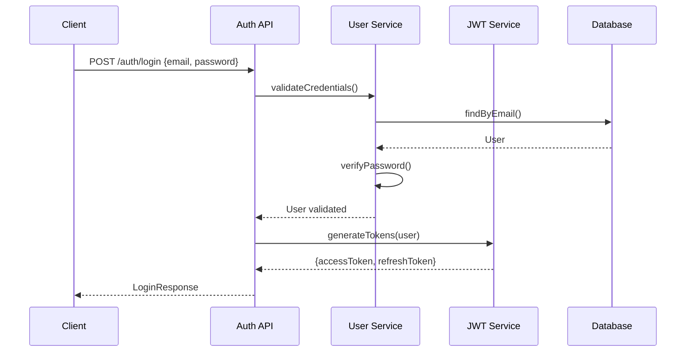

# Authentication

## Overview

Authentication uses JWT tokens with support for social login providers.

---

## Auth Flow Diagram



---

## JWT Configuration

```java
// config/JwtConfig.java
@Configuration
@ConfigurationProperties(prefix = "jwt")
@Getter @Setter
public class JwtConfig {
    private String secret;
    private long accessTokenExpiration = 3600000; // 1 hour
    private long refreshTokenExpiration = 604800000; // 7 days
    private String issuer = "egypttours.com";
}
```

### Token Structure

```json
{
  "sub": "user@example.com",
  "userId": 12345,
  "roles": ["CUSTOMER"],
  "iat": 1707000000,
  "exp": 1707003600,
  "iss": "egypttours.com"
}
```

---

## Auth Endpoints

| Endpoint | Method | Description |
|----------|--------|-------------|
| `/auth/register` | POST | User registration |
| `/auth/login` | POST | Email/password login |
| `/auth/refresh` | POST | Refresh access token |
| `/auth/logout` | POST | Invalidate tokens |
| `/auth/forgot-password` | POST | Request password reset |
| `/auth/reset-password` | POST | Reset password |
| `/auth/verify-email` | GET | Verify email address |
| `/auth/google` | POST | Google OAuth |
| `/auth/facebook` | POST | Facebook OAuth |

---

## Implementation

### Auth Controller

```java
@RestController
@RequestMapping("/api/v1/auth")
@Tag(name = "Authentication")
public class AuthController {

    private final AuthService authService;

    @PostMapping("/register")
    public ResponseEntity<ApiResponse<Void>> register(
            @Valid @RequestBody RegisterRequest request) {
        authService.register(request);
        return ResponseEntity.status(HttpStatus.CREATED)
            .body(ApiResponse.success("Registration successful. Please verify your email."));
    }

    @PostMapping("/login")
    public ResponseEntity<LoginResponse> login(
            @Valid @RequestBody LoginRequest request) {
        return ResponseEntity.ok(authService.login(request));
    }

    @PostMapping("/refresh")
    public ResponseEntity<TokenResponse> refresh(
            @RequestBody RefreshTokenRequest request) {
        return ResponseEntity.ok(authService.refresh(request.getRefreshToken()));
    }
}
```

### Auth Service

```java
@Service
public class AuthServiceImpl implements AuthService {

    private final UserRepository userRepository;
    private final PasswordEncoder passwordEncoder;
    private final JwtService jwtService;
    private final EmailService emailService;

    @Override
    @Transactional
    public void register(RegisterRequest request) {
        if (userRepository.existsByEmail(request.getEmail())) {
            throw new ApiException("Email already registered");
        }

        User user = User.builder()
            .email(request.getEmail())
            .password(passwordEncoder.encode(request.getPassword()))
            .firstName(request.getFirstName())
            .lastName(request.getLastName())
            .role(Role.CUSTOMER)
            .emailVerified(false)
            .build();

        user = userRepository.save(user);

        String token = jwtService.generateEmailVerificationToken(user);
        emailService.sendVerificationEmail(user.getEmail(), token);
    }

    @Override
    public LoginResponse login(LoginRequest request) {
        User user = userRepository.findByEmail(request.getEmail())
            .orElseThrow(() -> new ApiException("Invalid credentials"));

        if (!passwordEncoder.matches(request.getPassword(), user.getPassword())) {
            throw new ApiException("Invalid credentials");
        }

        if (!user.isEmailVerified()) {
            throw new ApiException("Please verify your email first");
        }

        String accessToken = jwtService.generateAccessToken(user);
        String refreshToken = jwtService.generateRefreshToken(user);

        return LoginResponse.builder()
            .accessToken(accessToken)
            .refreshToken(refreshToken)
            .user(UserDTO.from(user))
            .build();
    }
}
```

### JWT Service

```java
@Service
public class JwtService {

    private final JwtConfig jwtConfig;
    private final Key signingKey;

    @PostConstruct
    public void init() {
        this.signingKey = Keys.hmacShaKeyFor(
            jwtConfig.getSecret().getBytes(StandardCharsets.UTF_8)
        );
    }

    public String generateAccessToken(User user) {
        return Jwts.builder()
            .setSubject(user.getEmail())
            .claim("userId", user.getId())
            .claim("roles", List.of(user.getRole().name()))
            .setIssuedAt(new Date())
            .setExpiration(new Date(System.currentTimeMillis() + jwtConfig.getAccessTokenExpiration()))
            .setIssuer(jwtConfig.getIssuer())
            .signWith(signingKey, SignatureAlgorithm.HS256)
            .compact();
    }

    public Claims validateToken(String token) {
        return Jwts.parserBuilder()
            .setSigningKey(signingKey)
            .build()
            .parseClaimsJws(token)
            .getBody();
    }
}
```

---

## Social Login

### Google OAuth

```java
@PostMapping("/google")
public ResponseEntity<LoginResponse> googleLogin(
        @RequestBody SocialLoginRequest request) {
    GoogleIdToken.Payload payload = googleAuthService.verify(request.getIdToken());
    User user = findOrCreateSocialUser(payload, AuthProvider.GOOGLE);
    return ResponseEntity.ok(generateLoginResponse(user));
}
```

### Facebook OAuth

```java
@PostMapping("/facebook")
public ResponseEntity<LoginResponse> facebookLogin(
        @RequestBody SocialLoginRequest request) {
    FacebookUser fbUser = facebookAuthService.verify(request.getAccessToken());
    User user = findOrCreateSocialUser(fbUser, AuthProvider.FACEBOOK);
    return ResponseEntity.ok(generateLoginResponse(user));
}
```

---

## Security Filter

```java
@Component
public class JwtAuthenticationFilter extends OncePerRequestFilter {

    private final JwtService jwtService;
    private final UserDetailsService userDetailsService;

    @Override
    protected void doFilterInternal(
            HttpServletRequest request,
            HttpServletResponse response,
            FilterChain chain) throws ServletException, IOException {

        String authHeader = request.getHeader("Authorization");

        if (authHeader == null || !authHeader.startsWith("Bearer ")) {
            chain.doFilter(request, response);
            return;
        }

        String token = authHeader.substring(7);

        try {
            Claims claims = jwtService.validateToken(token);
            String email = claims.getSubject();

            UserDetails userDetails = userDetailsService.loadUserByUsername(email);
            UsernamePasswordAuthenticationToken auth =
                new UsernamePasswordAuthenticationToken(
                    userDetails, null, userDetails.getAuthorities()
                );

            SecurityContextHolder.getContext().setAuthentication(auth);
        } catch (JwtException e) {
            // Token invalid - continue without auth
        }

        chain.doFilter(request, response);
    }
}
```
