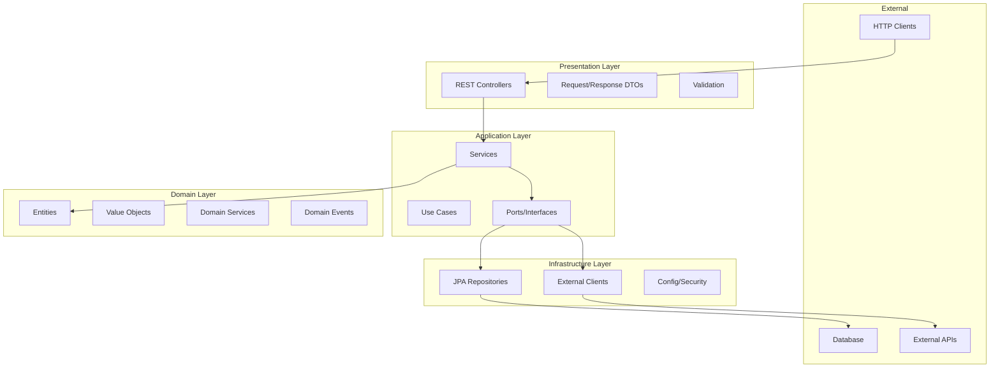

# Clean Architecture

## Overview

The backend follows Clean Architecture principles with clear separation between layers.

---

## Architecture Diagram



---

## Directory Structure

```
src/main/java/com/egypttours/
├── EgyptToursApplication.java
│
├── common/                        # Shared utilities
│   ├── exception/
│   │   ├── ApiException.java
│   │   ├── ResourceNotFoundException.java
│   │   └── GlobalExceptionHandler.java
│   ├── dto/
│   │   ├── ApiResponse.java
│   │   ├── PagedResponse.java
│   │   └── ErrorResponse.java
│   └── util/
│       ├── DateUtils.java
│       └── SlugUtils.java
│
├── config/                        # Configuration
│   ├── SecurityConfig.java
│   ├── CorsConfig.java
│   ├── JwtConfig.java
│   ├── OpenApiConfig.java
│   └── CacheConfig.java
│
├── trip/                          # Trip domain module
│   ├── domain/
│   │   ├── Trip.java
│   │   ├── ItineraryDay.java
│   │   ├── PriceRule.java
│   │   └── TripStatus.java
│   ├── repository/
│   │   ├── TripRepository.java
│   │   └── TripSpecifications.java
│   ├── service/
│   │   ├── TripService.java
│   │   └── TripServiceImpl.java
│   ├── dto/
│   │   ├── TripDTO.java
│   │   ├── TripListDTO.java
│   │   ├── CreateTripRequest.java
│   │   └── TripFilterRequest.java
│   ├── mapper/
│   │   └── TripMapper.java
│   └── controller/
│       ├── TripController.java
│       └── AdminTripController.java
│
├── booking/                       # Booking domain module
│   ├── domain/
│   ├── repository/
│   ├── service/
│   ├── dto/
│   └── controller/
│
├── user/                          # User domain module
│   ├── domain/
│   ├── repository/
│   ├── service/
│   ├── dto/
│   └── controller/
│
├── content/                       # Content module (blog, vlogs)
│   ├── blog/
│   └── vlog/
│
├── support/                       # Support tickets
│   ├── domain/
│   ├── repository/
│   ├── service/
│   └── controller/
│
├── payment/                       # Payment processing
│   ├── service/
│   ├── provider/
│   │   └── StripePaymentProvider.java
│   └── dto/
│
└── notification/                  # Notifications
    ├── service/
    ├── email/
    └── template/
```

---

## Layer Responsibilities

### Presentation Layer

| Component | Responsibility |
|-----------|---------------|
| Controllers | HTTP endpoints, request routing |
| DTOs | Request/response data shapes |
| Validation | Input validation, sanitization |
| Exception Handler | Error response formatting |

```java
@RestController
@RequestMapping("/api/v1/trips")
@Tag(name = "Trips", description = "Trip management APIs")
public class TripController {

    private final TripService tripService;

    @GetMapping
    public ResponseEntity<PagedResponse<TripListDTO>> getTrips(
            @Valid TripFilterRequest filter,
            Pageable pageable) {
        return ResponseEntity.ok(tripService.findTrips(filter, pageable));
    }

    @GetMapping("/{slug}")
    public ResponseEntity<TripDTO> getTrip(@PathVariable String slug) {
        return ResponseEntity.ok(tripService.findBySlug(slug));
    }
}
```

### Application Layer

| Component | Responsibility |
|-----------|---------------|
| Services | Business logic orchestration |
| Use Cases | Specific business operations |
| Mappers | Entity ↔ DTO conversion |
| Ports | Interfaces for infrastructure |

```java
@Service
@Transactional(readOnly = true)
public class TripServiceImpl implements TripService {

    private final TripRepository tripRepository;
    private final TripMapper tripMapper;
    private final CacheManager cacheManager;

    @Override
    public TripDTO findBySlug(String slug) {
        Trip trip = tripRepository.findBySlugAndStatus(slug, TripStatus.PUBLISHED)
            .orElseThrow(() -> new ResourceNotFoundException("Trip", "slug", slug));
        return tripMapper.toDTO(trip);
    }

    @Override
    @Transactional
    @CacheEvict(value = "trips", allEntries = true)
    public TripDTO createTrip(CreateTripRequest request) {
        Trip trip = tripMapper.toEntity(request);
        trip.setSlug(SlugUtils.generate(request.getTitle()));
        trip = tripRepository.save(trip);
        return tripMapper.toDTO(trip);
    }
}
```

### Domain Layer

| Component | Responsibility |
|-----------|---------------|
| Entities | Core business objects |
| Value Objects | Immutable domain values |
| Domain Services | Complex business logic |
| Domain Events | State change notifications |

```java
@Entity
@Table(name = "trips")
@Getter @Setter
public class Trip extends BaseEntity {

    @Id
    @GeneratedValue(strategy = GenerationType.IDENTITY)
    private Long id;

    @Column(nullable = false)
    private String title;

    @Column(unique = true, nullable = false)
    private String slug;

    @Lob
    private String description;

    @Enumerated(EnumType.STRING)
    private TripStatus status = TripStatus.DRAFT;

    @ManyToOne(fetch = FetchType.LAZY)
    private Destination destination;

    @OneToMany(mappedBy = "trip", cascade = CascadeType.ALL, orphanRemoval = true)
    @OrderBy("dayNumber")
    private List<ItineraryDay> itinerary = new ArrayList<>();

    @OneToMany(mappedBy = "trip", cascade = CascadeType.ALL)
    private List<PriceRule> priceRules = new ArrayList<>();

    // Domain logic
    public Money getBasePrice() {
        return priceRules.stream()
            .filter(PriceRule::isDefault)
            .findFirst()
            .map(PriceRule::getPrice)
            .orElseThrow();
    }
}
```

### Infrastructure Layer

| Component | Responsibility |
|-----------|---------------|
| Repositories | Database access |
| External Clients | Third-party integrations |
| Config | Application configuration |
| Security | Auth implementation |

---

## Dependency Rules

```
Presentation → Application → Domain ← Infrastructure
                    ↓
              Infrastructure
```

- **Domain** has NO external dependencies
- **Application** depends only on Domain
- **Infrastructure** implements Domain interfaces
- **Presentation** uses Application services
