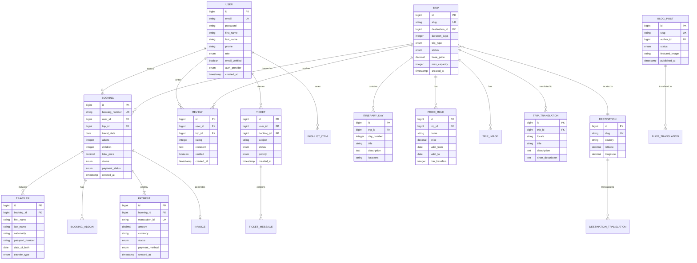

# Database Design

## Overview

PostgreSQL database with JPA/Hibernate ORM.

---

## Entity Relationship Diagram



---

## Entity Definitions

### User Entity

```java
@Entity
@Table(name = "users")
public class User extends BaseEntity {
    
    @Id
    @GeneratedValue(strategy = GenerationType.IDENTITY)
    private Long id;
    
    @Column(unique = true, nullable = false)
    private String email;
    
    @Column(nullable = false)
    private String password;
    
    @Column(name = "first_name", nullable = false)
    private String firstName;
    
    @Column(name = "last_name", nullable = false)
    private String lastName;
    
    private String phone;
    
    @Enumerated(EnumType.STRING)
    @Column(nullable = false)
    private Role role = Role.CUSTOMER;
    
    @Column(name = "email_verified")
    private boolean emailVerified = false;
    
    @Enumerated(EnumType.STRING)
    @Column(name = "auth_provider")
    private AuthProvider authProvider = AuthProvider.LOCAL;
    
    @OneToMany(mappedBy = "user")
    private List<Booking> bookings = new ArrayList<>();
    
    @OneToMany(mappedBy = "user")
    private List<Review> reviews = new ArrayList<>();
}
```

### Trip Entity

```java
@Entity
@Table(name = "trips")
public class Trip extends BaseEntity {
    
    @Id
    @GeneratedValue(strategy = GenerationType.IDENTITY)
    private Long id;
    
    @Column(unique = true, nullable = false)
    private String slug;
    
    @ManyToOne(fetch = FetchType.LAZY)
    @JoinColumn(name = "destination_id")
    private Destination destination;
    
    @Column(name = "duration_days")
    private Integer durationDays;
    
    @Enumerated(EnumType.STRING)
    @Column(name = "trip_type")
    private TripType tripType;
    
    @Enumerated(EnumType.STRING)
    private TripStatus status = TripStatus.DRAFT;
    
    @Column(name = "base_price", precision = 10, scale = 2)
    private BigDecimal basePrice;
    
    @Column(name = "max_capacity")
    private Integer maxCapacity;
    
    @OneToMany(mappedBy = "trip", cascade = CascadeType.ALL, orphanRemoval = true)
    private List<TripTranslation> translations = new ArrayList<>();
    
    @OneToMany(mappedBy = "trip", cascade = CascadeType.ALL, orphanRemoval = true)
    @OrderBy("dayNumber ASC")
    private List<ItineraryDay> itinerary = new ArrayList<>();
    
    @OneToMany(mappedBy = "trip", cascade = CascadeType.ALL)
    private List<PriceRule> priceRules = new ArrayList<>();
    
    @OneToMany(mappedBy = "trip", cascade = CascadeType.ALL)
    @OrderBy("sortOrder ASC")
    private List<TripImage> images = new ArrayList<>();
}
```

### Booking Entity

```java
@Entity
@Table(name = "bookings")
public class Booking extends BaseEntity {
    
    @Id
    @GeneratedValue(strategy = GenerationType.IDENTITY)
    private Long id;
    
    @Column(name = "booking_number", unique = true, nullable = false)
    private String bookingNumber;
    
    @ManyToOne(fetch = FetchType.LAZY)
    @JoinColumn(name = "user_id", nullable = false)
    private User user;
    
    @ManyToOne(fetch = FetchType.LAZY)
    @JoinColumn(name = "trip_id", nullable = false)
    private Trip trip;
    
    @Column(name = "travel_date", nullable = false)
    private LocalDate travelDate;
    
    private Integer adults = 1;
    private Integer children = 0;
    
    @Column(name = "total_price", precision = 10, scale = 2)
    private BigDecimal totalPrice;
    
    @Enumerated(EnumType.STRING)
    private BookingStatus status = BookingStatus.PENDING;
    
    @Enumerated(EnumType.STRING)
    @Column(name = "payment_status")
    private PaymentStatus paymentStatus = PaymentStatus.PENDING;
    
    @OneToMany(mappedBy = "booking", cascade = CascadeType.ALL, orphanRemoval = true)
    private List<Traveler> travelers = new ArrayList<>();
    
    @OneToMany(mappedBy = "booking", cascade = CascadeType.ALL)
    private List<Payment> payments = new ArrayList<>();
    
    @PrePersist
    public void generateBookingNumber() {
        this.bookingNumber = "ET-" + UUID.randomUUID().toString().substring(0, 8).toUpperCase();
    }
}
```

---

## Indexes

```sql
-- Performance indexes
CREATE INDEX idx_trips_destination ON trips(destination_id);
CREATE INDEX idx_trips_status ON trips(status);
CREATE INDEX idx_trips_slug ON trips(slug);

CREATE INDEX idx_bookings_user ON bookings(user_id);
CREATE INDEX idx_bookings_status ON bookings(status);
CREATE INDEX idx_bookings_date ON bookings(travel_date);

CREATE INDEX idx_reviews_trip ON reviews(trip_id);
CREATE INDEX idx_reviews_user ON reviews(user_id);

-- Composite indexes
CREATE INDEX idx_trips_dest_status ON trips(destination_id, status);
CREATE INDEX idx_bookings_user_status ON bookings(user_id, status);
```

---

## Enums

```java
public enum Role {
    GUEST, CUSTOMER, EDITOR, BOOKING_AGENT, SUPPORT_AGENT, ADMIN
}

public enum TripStatus {
    DRAFT, PUBLISHED, ARCHIVED
}

public enum TripType {
    PACKAGE, DAY_TOUR, CRUISE, PRIVATE
}

public enum BookingStatus {
    PENDING, CONFIRMED, CANCELLED, COMPLETED, REFUNDED
}

public enum PaymentStatus {
    PENDING, PARTIAL, PAID, REFUNDED
}
```
