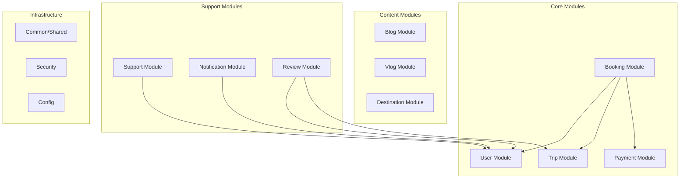

# Backend Modules

## Module Overview

The backend is organized into domain-driven modules, each encapsulating a specific business capability.

---

## Module Diagram



---

## Module Details

### User Module (`/user`)

Handles user authentication, registration, and profile management.

| Entity | Description |
|--------|-------------|
| `User` | Core user entity |
| `Role` | User roles (CUSTOMER, ADMIN, etc.) |
| `Profile` | Extended user info |
| `PasswordReset` | Password reset tokens |

```
user/
├── domain/
│   ├── User.java
│   ├── Role.java
│   ├── Profile.java
│   └── PasswordResetToken.java
├── repository/
│   └── UserRepository.java
├── service/
│   ├── UserService.java
│   ├── AuthService.java
│   └── ProfileService.java
├── dto/
│   ├── UserDTO.java
│   ├── RegisterRequest.java
│   ├── LoginRequest.java
│   └── LoginResponse.java
└── controller/
    ├── AuthController.java
    └── ProfileController.java
```

---

### Trip Module (`/trip`)

Manages tours, itineraries, and availability.

| Entity | Description |
|--------|-------------|
| `Trip` | Core tour package |
| `ItineraryDay` | Day-by-day breakdown |
| `PriceRule` | Pricing logic |
| `TripImage` | Gallery images |
| `TripTranslation` | i18n content |

```
trip/
├── domain/
│   ├── Trip.java
│   ├── ItineraryDay.java
│   ├── PriceRule.java
│   ├── TripImage.java
│   ├── TripTranslation.java
│   └── TripStatus.java
├── repository/
│   ├── TripRepository.java
│   └── TripSpecifications.java
├── service/
│   ├── TripService.java
│   ├── AvailabilityService.java
│   └── PricingService.java
├── dto/
│   ├── TripDTO.java
│   ├── TripListDTO.java
│   ├── CreateTripRequest.java
│   └── UpdateTripRequest.java
└── controller/
    ├── TripController.java          # Public API
    └── AdminTripController.java     # Admin API
```

---

### Booking Module (`/booking`)

Handles the complete booking lifecycle.

| Entity | Description |
|--------|-------------|
| `Booking` | Core booking record |
| `Traveler` | Individual traveler info |
| `BookingAddOn` | Optional extras |
| `Invoice` | Generated invoices |

```
booking/
├── domain/
│   ├── Booking.java
│   ├── BookingStatus.java
│   ├── Traveler.java
│   ├── BookingAddOn.java
│   └── Invoice.java
├── repository/
│   └── BookingRepository.java
├── service/
│   ├── BookingService.java
│   ├── InvoiceService.java
│   └── CancellationService.java
├── dto/
│   ├── BookingDTO.java
│   ├── CreateBookingRequest.java
│   └── BookingStatusDTO.java
└── controller/
    ├── BookingController.java
    └── AdminBookingController.java
```

---

### Payment Module (`/payment`)

Integrates with payment gateways.

| Component | Description |
|-----------|-------------|
| `PaymentService` | Payment orchestration |
| `StripeProvider` | Stripe integration |
| `RefundService` | Refund processing |

```
payment/
├── domain/
│   ├── Payment.java
│   ├── PaymentStatus.java
│   └── Refund.java
├── provider/
│   ├── PaymentProvider.java      # Interface
│   └── StripePaymentProvider.java
├── service/
│   ├── PaymentService.java
│   └── RefundService.java
└── dto/
    ├── PaymentRequest.java
    └── PaymentResponse.java
```

---

### Destination Module (`/destination`)

Manages Egypt destinations.

| Entity | Description |
|--------|-------------|
| `Destination` | Destination info |
| `DestinationTranslation` | i18n content |

---

### Content Module (`/content`)

Blog and vlog content management.

```
content/
├── blog/
│   ├── domain/BlogPost.java
│   ├── repository/
│   ├── service/
│   └── controller/
└── vlog/
    ├── domain/Vlog.java
    ├── repository/
    ├── service/
    └── controller/
```

---

### Review Module (`/review`)

Customer reviews and ratings.

| Entity | Description |
|--------|-------------|
| `Review` | Customer review |
| `ReviewResponse` | Admin responses |

---

### Support Module (`/support`)

Support ticket system.

| Entity | Description |
|--------|-------------|
| `Ticket` | Support ticket |
| `TicketMessage` | Ticket replies |
| `TicketStatus` | Ticket states |

---

### Notification Module (`/notification`)

Email and notification handling.

| Component | Description |
|-----------|-------------|
| `EmailService` | Email sending |
| `TemplateService` | Email templates |
| `NotificationService` | In-app notifications |

---

## Module Dependencies

| Module | Depends On |
|--------|------------|
| User | Common |
| Trip | Common, Destination |
| Booking | User, Trip, Payment |
| Payment | Common |
| Review | User, Trip |
| Support | User |
| Notification | User, Common |
| Content | Common |
