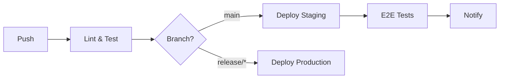

# CI/CD Pipeline

## Pipeline Overview



---

## GitHub Actions

### Frontend Pipeline

```yaml
# .github/workflows/frontend.yml
name: Frontend CI/CD

on:
  push:
    branches: [main, release/*]
    paths: ['frontend/**']

jobs:
  test:
    runs-on: ubuntu-latest
    steps:
      - uses: actions/checkout@v4
      - uses: actions/setup-node@v4
        with: { node-version: 20 }
      - run: npm ci
      - run: npm run lint
      - run: npm run test

  deploy:
    needs: test
    runs-on: ubuntu-latest
    steps:
      - uses: actions/checkout@v4
      - uses: amondnet/vercel-action@v25
        with:
          vercel-token: ${{ secrets.VERCEL_TOKEN }}
          vercel-org-id: ${{ secrets.VERCEL_ORG_ID }}
          vercel-project-id: ${{ secrets.VERCEL_PROJECT_ID }}
```

### Backend Pipeline

```yaml
# .github/workflows/backend.yml
name: Backend CI/CD

on:
  push:
    branches: [main, release/*]
    paths: ['backend/**']

jobs:
  test:
    runs-on: ubuntu-latest
    steps:
      - uses: actions/checkout@v4
      - uses: actions/setup-java@v4
        with: { java-version: 21, distribution: temurin }
      - run: ./gradlew test

  build:
    needs: test
    runs-on: ubuntu-latest
    steps:
      - uses: actions/checkout@v4
      - run: ./gradlew bootJar
      - uses: docker/build-push-action@v5
        with:
          push: true
          tags: egypttours/api:${{ github.sha }}

  deploy:
    needs: build
    runs-on: ubuntu-latest
    steps:
      - name: Deploy to ECS
        run: aws ecs update-service --cluster prod --service api --force-new-deployment
```

---

## Branch Strategy

| Branch | Purpose | Deploys To |
|--------|---------|------------|
| `main` | Development | Staging |
| `release/*` | Release candidates | Production |
| `feature/*` | Feature work | Preview |
