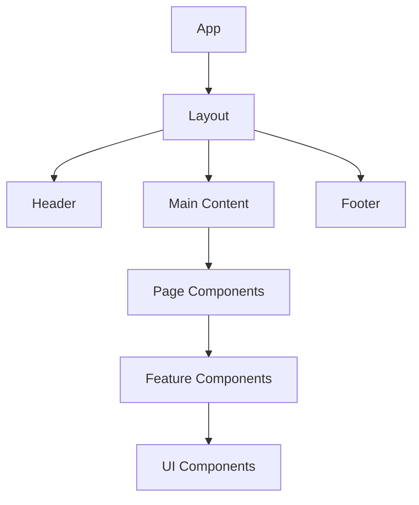

# React Structure

## Component Organization

Components are organized by type and feature for maximum reusability and maintainability.

---

## Component Hierarchy



---

## Component Categories

### UI Components (`/components/ui/`)

Atomic, reusable building blocks with no business logic.

| Component | Description |
|-----------|-------------|
| `Button` | Primary, secondary, outline variants |
| `Card` | Container with shadow and padding |
| `Input` | Text input with validation |
| `Modal` | Dialog overlay |
| `Dropdown` | Select/menu |
| `Tabs` | Tab navigation |
| `Badge` | Status indicators |
| `Avatar` | User images |
| `Rating` | Star rating display |
| `Price` | Formatted currency |
| `Skeleton` | Loading placeholders |
| `Toast` | Notifications |

### Common Components (`/components/common/`)

Shared layout and navigation components.

| Component | Description |
|-----------|-------------|
| `Header` | Top navigation bar |
| `Footer` | Site footer |
| `Navbar` | Main navigation |
| `Sidebar` | Admin sidebar |
| `Breadcrumb` | Navigation breadcrumbs |
| `Pagination` | Page controls |
| `SearchBar` | Global search |
| `LanguageSwitcher` | Locale selector |
| `ChatWidget` | AI assistant |

### Feature Components

#### Trips (`/components/trips/`)

| Component | Description |
|-----------|-------------|
| `TripCard` | Trip preview card |
| `TripGrid` | Grid layout |
| `TripFilters` | Filter panel |
| `TripDetails` | Full trip view |
| `Itinerary` | Day-by-day timeline |
| `Gallery` | Image carousel |
| `ReviewList` | Customer reviews |
| `RelatedTrips` | Recommendations |

#### Booking (`/components/booking/`)

| Component | Description |
|-----------|-------------|
| `DatePicker` | Availability calendar |
| `TravelerSelector` | Adults/children counter |
| `OptionsSelector` | Add-ons selection |
| `BookingSummary` | Order summary |
| `TravelerForm` | Traveler details form |
| `PaymentForm` | Payment input |

#### Auth (`/components/auth/`)

| Component | Description |
|-----------|-------------|
| `LoginForm` | Email/password login |
| `RegisterForm` | Registration form |
| `SocialLogin` | OAuth buttons |
| `ForgotPassword` | Password reset |
| `ProtectedRoute` | Auth guard |

---

## Component Template

```tsx
// components/trips/TripCard/index.ts
export { TripCard } from './TripCard';
export type { TripCardProps } from './TripCard.types';

// components/trips/TripCard/TripCard.tsx
import { FC } from 'react';
import { useTranslation } from 'next-i18next';
import { Card, Button, Rating, Price, Image } from '@/components/ui';
import { useWishlist } from '@/hooks/useWishlist';
import type { TripCardProps } from './TripCard.types';
import styles from './TripCard.module.css';

export const TripCard: FC<TripCardProps> = ({ 
  trip, 
  variant = 'default',
  showWishlist = true,
}) => {
  const { t } = useTranslation('trips');
  const { isInWishlist, toggleWishlist } = useWishlist();

  return (
    <Card className={styles.card} data-variant={variant}>
      <div className={styles.imageWrapper}>
        <Image
          src={trip.thumbnail}
          alt={trip.title}
          fill
          sizes="(max-width: 768px) 100vw, 33vw"
        />
        {showWishlist && (
          <Button
            variant="icon"
            className={styles.wishlistBtn}
            onClick={() => toggleWishlist(trip.id)}
            aria-label={isInWishlist(trip.id) ? t('removeFromWishlist') : t('addToWishlist')}
          >
            <HeartIcon filled={isInWishlist(trip.id)} />
          </Button>
        )}
      </div>
      
      <div className={styles.content}>
        <span className={styles.destination}>{trip.destination}</span>
        <h3 className={styles.title}>{trip.title}</h3>
        
        <div className={styles.meta}>
          <Rating value={trip.rating} count={trip.reviewCount} />
          <span className={styles.duration}>
            {t('days', { count: trip.duration })}
          </span>
        </div>
        
        <div className={styles.footer}>
          <Price amount={trip.price} currency="USD" />
          <Button as="link" href={`/trips/${trip.slug}`}>
            {t('viewDetails')}
          </Button>
        </div>
      </div>
    </Card>
  );
};

// components/trips/TripCard/TripCard.types.ts
import type { Trip } from '@/types';

export interface TripCardProps {
  trip: Trip;
  variant?: 'default' | 'compact' | 'featured';
  showWishlist?: boolean;
}

// components/trips/TripCard/TripCard.module.css
.card {
  display: flex;
  flex-direction: column;
  border-radius: var(--radius-lg);
  overflow: hidden;
  transition: transform 0.2s, box-shadow 0.2s;
}

.card:hover {
  transform: translateY(-4px);
  box-shadow: var(--shadow-lg);
}

/* ... more styles */
```

---

## Page Components

| Page | Path | Components Used |
|------|------|-----------------|
| Home | `/` | Hero, FeaturedTrips, DestinationGrid |
| Trips List | `/trips` | TripGrid, TripFilters, Pagination |
| Trip Details | `/trips/[slug]` | TripDetails, Gallery, Itinerary, Reviews |
| Booking | `/booking` | BookingWizard, PaymentForm |
| Dashboard | `/account` | BookingsList, ProfileCard |
| Admin | `/admin/*` | Sidebar, DataTable, Forms |
