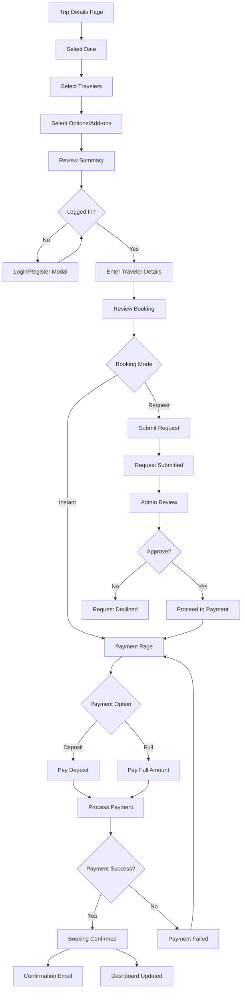
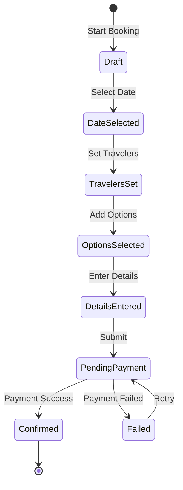

# Booking Flow

## Overview

The booking process supports two modes:

- **Instant Booking** — Immediate confirmation
- **Request-to-Book** — Admin confirmation required

---

## Booking Flow Diagram



---

## Step-by-Step Breakdown

### Step 1: Date Selection

| Element | Details |
|---------|---------|
| Calendar | Show available dates |
| Pricing | Update based on selected date |
| Availability | Real-time check |

```
┌─────────────────────────────────┐
│  Select Your Travel Date        │
├─────────────────────────────────┤
│  ◀ February 2026 ▶              │
│  Su Mo Tu We Th Fr Sa           │
│     1  2  3  4  5  6            │
│  7  8  9 10 11 12 13            │
│  14 15 [16] 17 18 19 20         │
│  21 22 23 24 25 26 27           │
│  28                              │
├─────────────────────────────────┤
│  Selected: Feb 16, 2026         │
│  Price: $599/person             │
└─────────────────────────────────┘
```

### Step 2: Traveler Selection

| Field | Type | Validation |
|-------|------|------------|
| Adults | Counter | Min 1, Max 20 |
| Children | Counter | Min 0, Max 10 |
| Infants | Counter | Min 0, Max 5 |

### Step 3: Options/Add-ons

| Add-on | Price | Description |
|--------|-------|-------------|
| Private Guide | +$100 | Dedicated guide |
| Photography | +$50 | Professional photos |
| Airport Transfer | +$30 | Round-trip |

### Step 4: Traveler Details

| Field | Required | Validation |
|-------|----------|------------|
| First Name | Yes | 2-50 chars |
| Last Name | Yes | 2-50 chars |
| Email | Yes | Valid email |
| Phone | Yes | Valid phone |
| Nationality | Yes | Dropdown |
| Passport Number | No | Alphanumeric |
| Special Requests | No | Free text |

### Step 5: Payment

#### Payment Options

| Option | Description | Rules |
|--------|-------------|-------|
| Deposit | Pay 30% now | Balance due 7 days before |
| Full Payment | Pay 100% now | Immediate confirmation |

#### Payment Methods

| Method | Provider | Supported |
|--------|----------|-----------|
| Credit Card | Stripe | ✅ |
| Debit Card | Stripe | ✅ |
| PayPal | PayPal | Phase 2 |

---

## State Management



### Booking States

| State | Description | Next Actions |
|-------|-------------|--------------|
| `DRAFT` | Booking started | Continue/Abandon |
| `PENDING_PAYMENT` | Awaiting payment | Pay/Cancel |
| `PENDING_CONFIRMATION` | Request mode - awaiting admin | Admin reviews |
| `CONFIRMED` | Payment received | View/Modify |
| `CANCELLED` | Cancelled by user/admin | Refund processing |
| `COMPLETED` | Trip completed | Leave review |
| `REFUNDED` | Refund processed | — |

---

## Cancellation Policy

| Timing | Refund |
|--------|--------|
| 30+ days before | 100% |
| 15-29 days before | 75% |
| 7-14 days before | 50% |
| < 7 days | No refund |

---

## Email Notifications

| Trigger | Email Type | Recipient |
|---------|------------|-----------|
| Booking confirmed | Confirmation | Customer |
| Payment received | Receipt | Customer |
| Booking request submitted | New request | Admin |
| Booking cancelled | Cancellation | Customer + Admin |
| Balance due reminder | Payment reminder | Customer |
| Trip tomorrow | Reminder | Customer |

---

## Error Handling

| Error | User Message | Recovery |
|-------|--------------|----------|
| Date unavailable | "This date is no longer available" | Select new date |
| Payment declined | "Payment was declined" | Try different method |
| Session expired | "Please login again" | Re-login, preserve cart |
| Network error | "Connection lost" | Retry with saved state |
