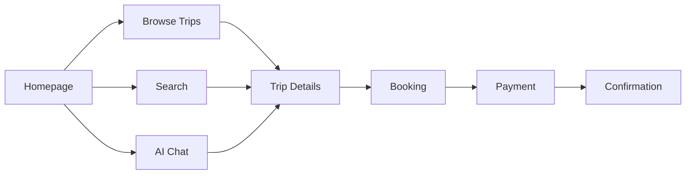

# UX Design Documentation

This section covers user experience design including flows, wireframes, and access control.

---

## Contents

| Document | Description |
|----------|-------------|
| [User Flows](user-flows.md) | Core user interaction flows |
| [Booking Flow](booking-flow.md) | Detailed booking process design |
| [Roles & Permissions](roles-permissions.md) | RBAC matrix and enforcement |

---

## Design Principles

1. **Mobile-first** — Responsive design starting from mobile
2. **Clarity** — Clear CTAs and navigation
3. **Trust** — Transparent pricing and policies
4. **Speed** — Fast loading and interactions
5. **Accessibility** — WCAG 2.1 AA compliance

---

## Key User Flows

