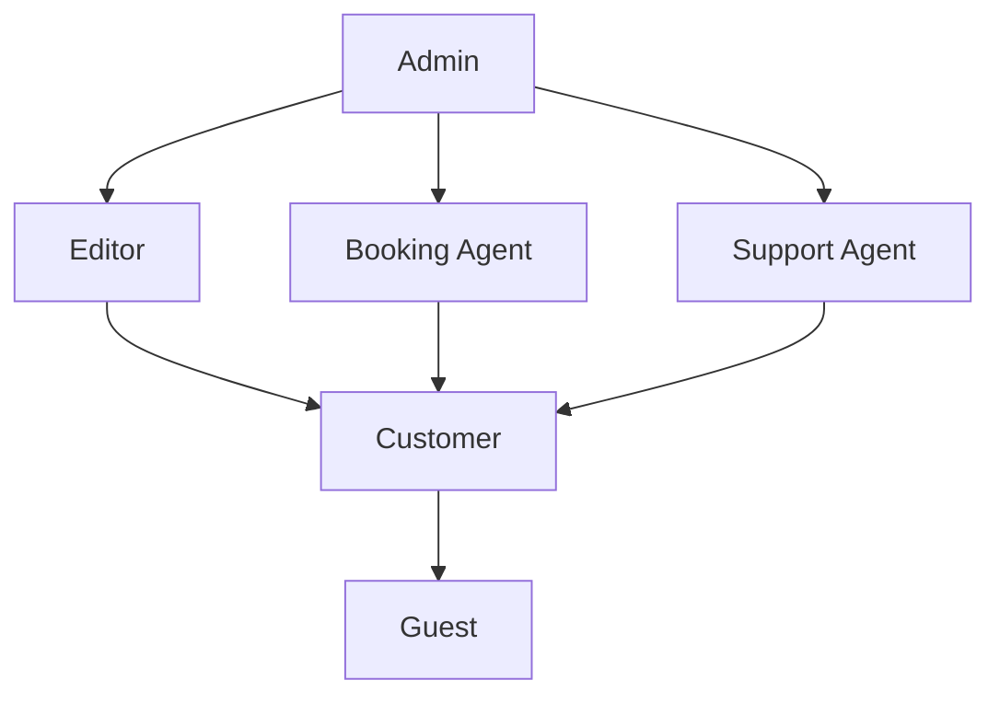

# Roles & Permissions

## Overview

The platform implements Role-Based Access Control (RBAC) with the following roles.

---

## Role Definitions

### Guest

- Unauthenticated user
- Browse-only access

### Customer

- Registered user
- Can make bookings and manage account

### Admin

- Full system access
- User management
- System configuration

### Editor / Content Manager

- Content creation and editing
- Blog, vlog, destination management
- Translation workflow

### Booking Agent / Operations

- Booking management
- Customer communication
- Availability management

### Support Agent

- Support ticket handling
- Customer inquiries
- Limited booking access

---

## RBAC Matrix

### Public Website

| Action | Guest | Customer | Admin |
|--------|-------|----------|-------|
| View trips | ✅ | ✅ | ✅ |
| View trip details | ✅ | ✅ | ✅ |
| View blog/vlogs | ✅ | ✅ | ✅ |
| Search | ✅ | ✅ | ✅ |
| Use AI chat | ✅ | ✅ | ✅ |
| Add to wishlist | ❌ | ✅ | ✅ |
| Start booking | ❌ | ✅ | ✅ |
| Submit contact form | ✅ | ✅ | ✅ |

### Booking & Payments

| Action | Guest | Customer | Agent | Admin |
|--------|-------|----------|-------|-------|
| Make booking | ❌ | ✅ | ✅ | ✅ |
| View own bookings | ❌ | ✅ | ❌ | ✅ |
| View all bookings | ❌ | ❌ | ✅ | ✅ |
| Cancel own booking | ❌ | ✅ | ❌ | ✅ |
| Cancel any booking | ❌ | ❌ | ✅ | ✅ |
| Process refunds | ❌ | ❌ | ✅ | ✅ |
| Modify bookings | ❌ | ❌ | ✅ | ✅ |

### Customer Portal

| Action | Guest | Customer | Support | Admin |
|--------|-------|----------|---------|-------|
| View dashboard | ❌ | ✅ | ❌ | ✅ |
| Update profile | ❌ | ✅ | ❌ | ✅ |
| Download invoices | ❌ | ✅ | ❌ | ✅ |
| Create support ticket | ❌ | ✅ | ❌ | ✅ |
| View own tickets | ❌ | ✅ | ❌ | ✅ |
| Reply to own tickets | ❌ | ✅ | ❌ | ✅ |

### Content Management

| Action | Guest | Customer | Editor | Admin |
|--------|-------|----------|--------|-------|
| View content | ✅ | ✅ | ✅ | ✅ |
| Create blog posts | ❌ | ❌ | ✅ | ✅ |
| Edit blog posts | ❌ | ❌ | ✅ | ✅ |
| Delete blog posts | ❌ | ❌ | ✅ | ✅ |
| Manage destinations | ❌ | ❌ | ✅ | ✅ |
| Upload media | ❌ | ❌ | ✅ | ✅ |
| Manage translations | ❌ | ❌ | ✅ | ✅ |

### Trip Management

| Action | Agent | Editor | Admin |
|--------|-------|--------|-------|
| View trips | ✅ | ✅ | ✅ |
| Create trips | ❌ | ✅ | ✅ |
| Edit trips | ❌ | ✅ | ✅ |
| Delete trips | ❌ | ❌ | ✅ |
| Manage availability | ✅ | ❌ | ✅ |
| Set pricing rules | ❌ | ❌ | ✅ |

### Support Operations

| Action | Customer | Support | Admin |
|--------|----------|---------|-------|
| View all tickets | ❌ | ✅ | ✅ |
| Respond to tickets | Own only | ✅ | ✅ |
| Close tickets | ❌ | ✅ | ✅ |
| Escalate tickets | ❌ | ✅ | ✅ |
| View customer info | ❌ | ✅ | ✅ |

### Administration

| Action | Agent | Editor | Support | Admin |
|--------|-------|--------|---------|-------|
| View analytics | Limited | Limited | ❌ | ✅ |
| Manage users | ❌ | ❌ | ❌ | ✅ |
| Assign roles | ❌ | ❌ | ❌ | ✅ |
| View audit logs | ❌ | ❌ | ❌ | ✅ |
| System settings | ❌ | ❌ | ❌ | ✅ |

---

## Enforcement Points

### Frontend (React)

```typescript
// Route guards based on role
const ProtectedRoute = ({ 
  children, 
  requiredRoles 
}: { 
  children: ReactNode, 
  requiredRoles: Role[] 
}) => {
  const { user } = useAuth();
  
  if (!user) {
    return <Navigate to="/login" />;
  }
  
  if (!requiredRoles.includes(user.role)) {
    return <Navigate to="/unauthorized" />;
  }
  
  return children;
};

// Usage
<Route 
  path="/admin/bookings" 
  element={
    <ProtectedRoute requiredRoles={['ADMIN', 'BOOKING_AGENT']}>
      <BookingsPage />
    </ProtectedRoute>
  } 
/>
```

### Backend (Spring Boot)

```java
// Method-level security
@PreAuthorize("hasRole('ADMIN')")
@DeleteMapping("/api/trips/{id}")
public ResponseEntity<Void> deleteTrip(@PathVariable Long id) {
    tripService.delete(id);
    return ResponseEntity.noContent().build();
}

// Multiple roles
@PreAuthorize("hasAnyRole('ADMIN', 'BOOKING_AGENT')")
@GetMapping("/api/bookings")
public ResponseEntity<Page<BookingDTO>> getAllBookings(...) { ... }

// Custom permission check
@PreAuthorize("@bookingPermissions.canAccess(#id)")
@GetMapping("/api/bookings/{id}")
public ResponseEntity<BookingDTO> getBooking(@PathVariable Long id) { ... }
```

---

## Role Hierarchy



---

## Permission Inheritance

| Role | Inherits From |
|------|---------------|
| Admin | All roles |
| Editor | Customer |
| Booking Agent | Customer |
| Support Agent | Customer |
| Customer | Guest |
| Guest | None |

---

## JWT Token Structure

```json
{
  "sub": "user@example.com",
  "userId": 12345,
  "roles": ["CUSTOMER"],
  "permissions": [
    "booking:create",
    "booking:read:own",
    "profile:update"
  ],
  "iat": 1707000000,
  "exp": 1707003600
}
```

---

## Role Assignment Rules

| Rule | Description |
|------|-------------|
| Default role | New users get `CUSTOMER` role |
| Role changes | Admin only |
| Multiple roles | Supported |
| Role history | Audit logged |
