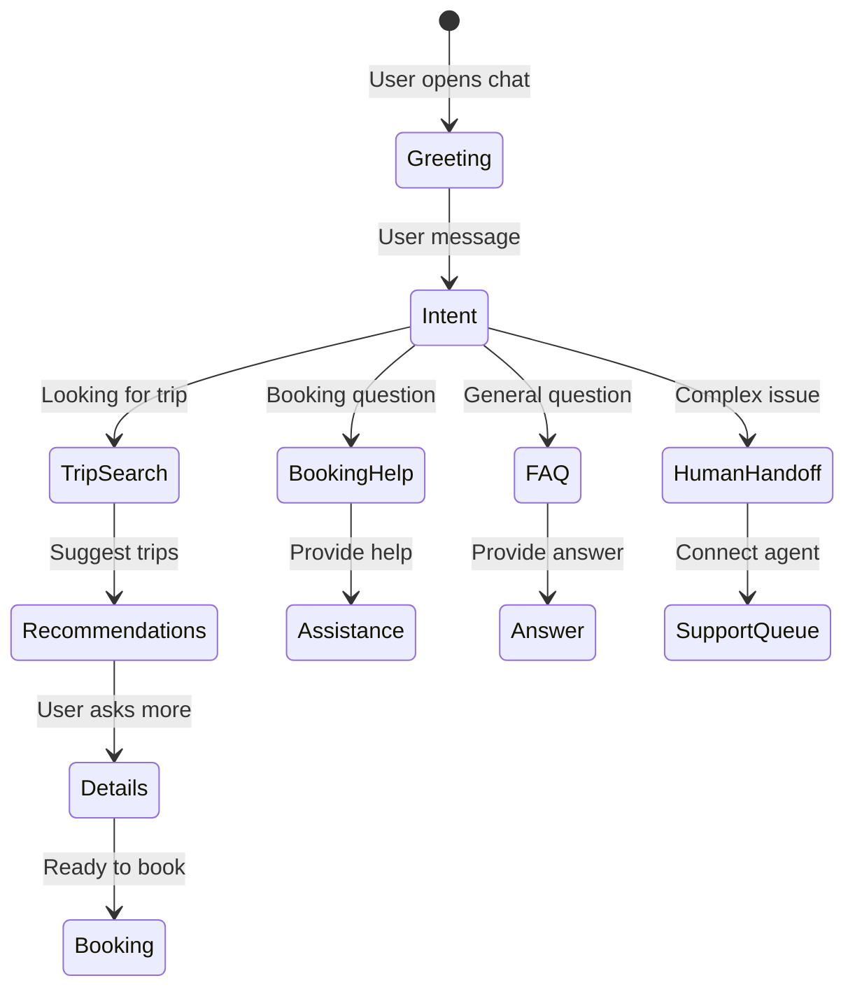

# AI Assistant Design

## Capabilities

| Capability | Description |
|------------|-------------|
| Trip Discovery | Recommend trips based on user preferences |
| Availability Check | Query real-time availability |
| Price Inquiry | Provide pricing information |
| FAQ Answering | Answer common travel questions |
| Booking Help | Guide through booking process |
| Customization | Help customize trip options |

---

## Conversation Flow



---

## Guardrails

| Rule | Description |
|------|-------------|
| Scope | Only Egypt travel topics |
| Pricing | Always use current data, never guess |
| Availability | Query API, don't assume |
| Personal Data | Don't ask for payment info |
| Escalation | Route complex issues to humans |

---

## Response Templates

### Trip Recommendation

```
Based on your preferences for {preference}, I recommend:

**{Trip Title}** - {Duration} days
{Short Description}
Starting from ${Price}

Would you like more details or to check availability?
```

### Availability Response

```
Great news! The {Trip Title} is available on {Date}.

Current pricing: ${Price} per person
Spots remaining: {Spots}

Would you like me to help you start your booking?
```
