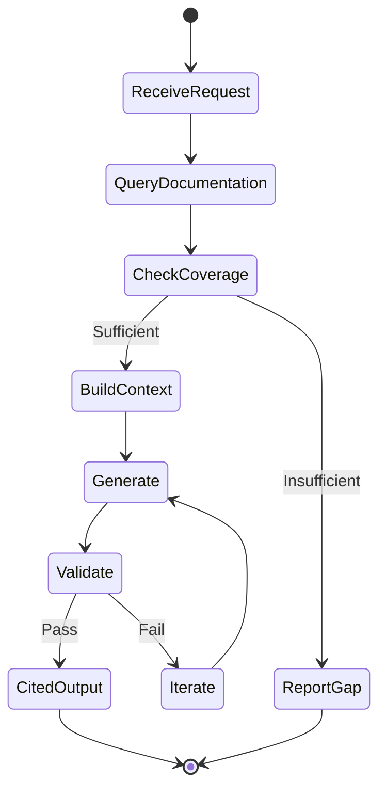
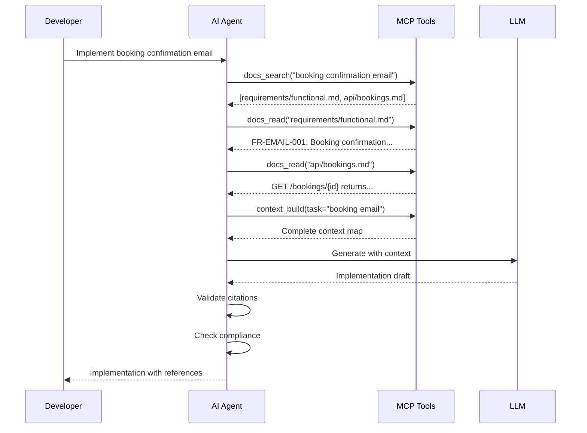
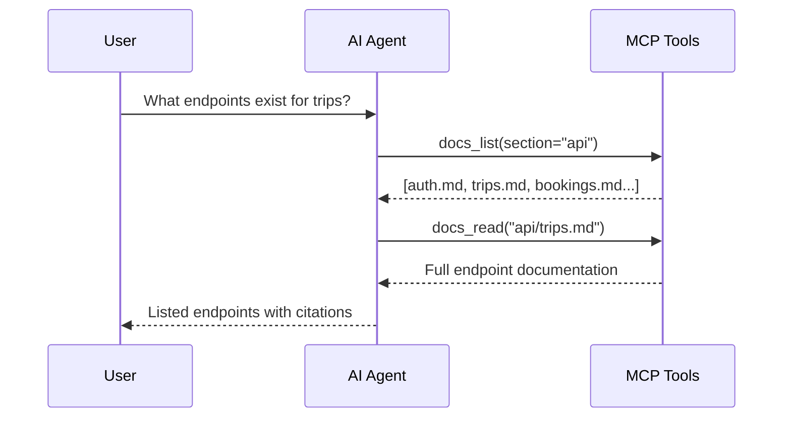
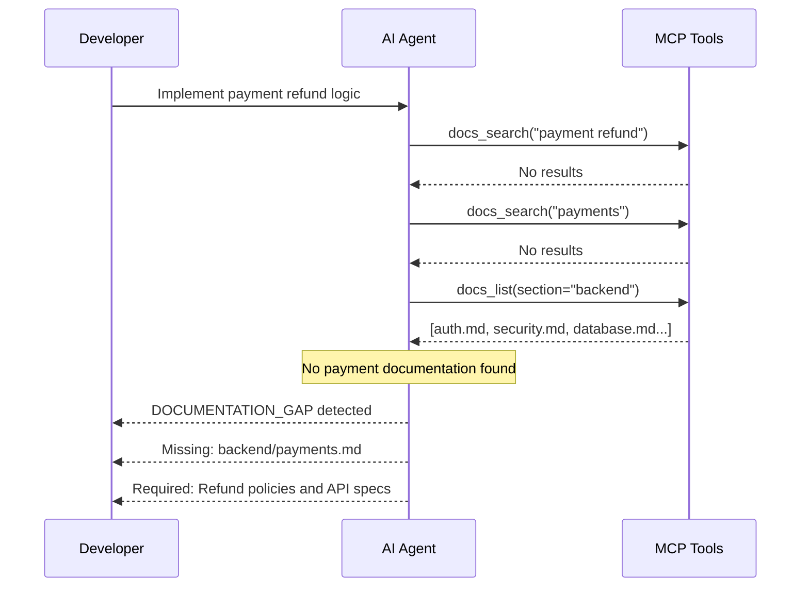
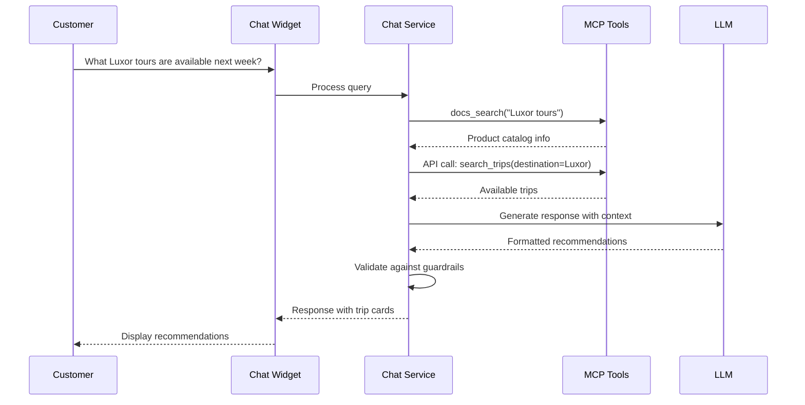
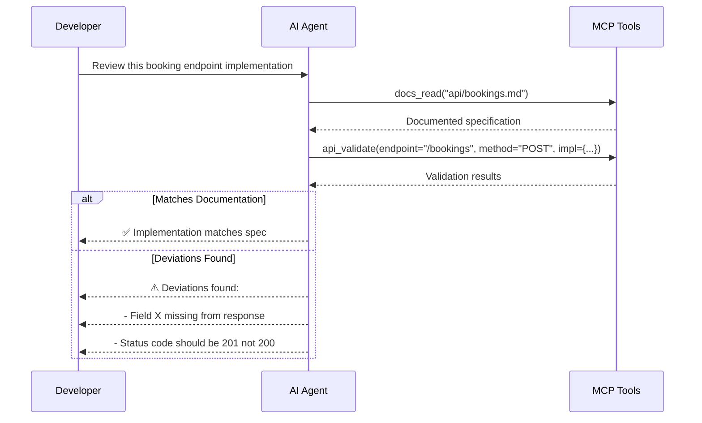
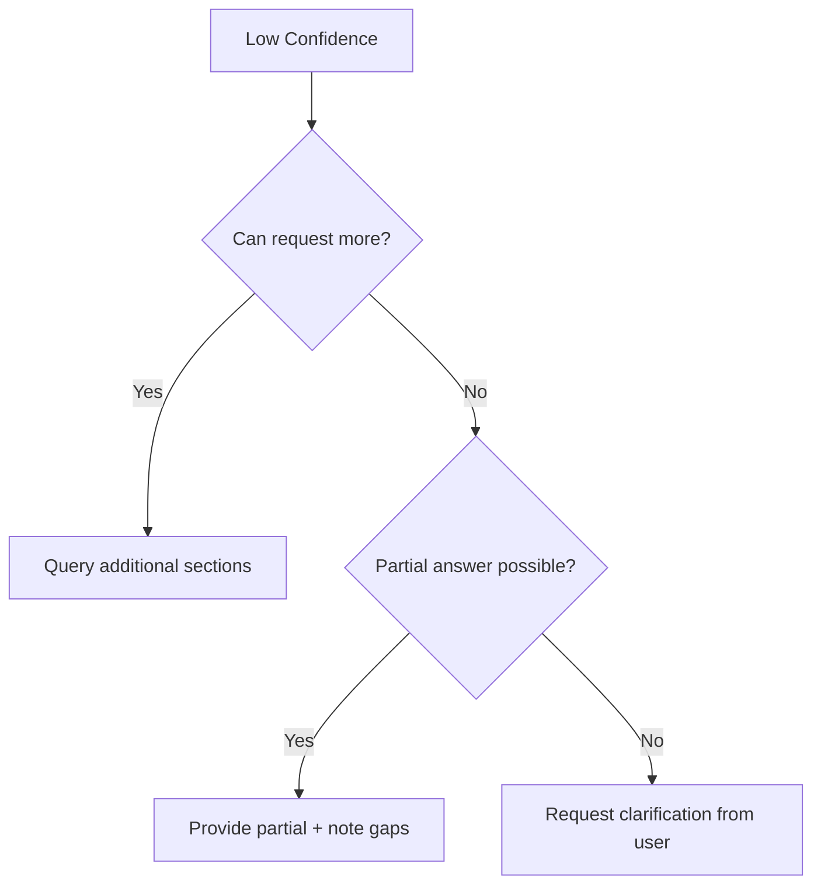
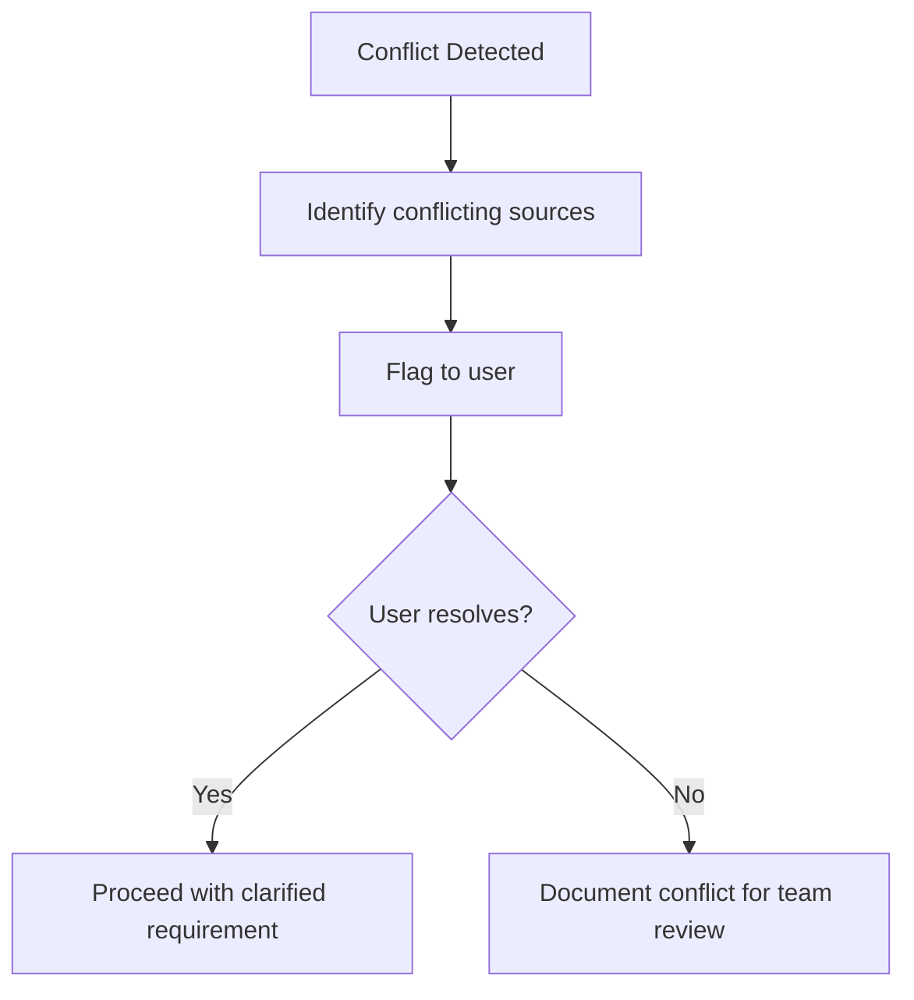
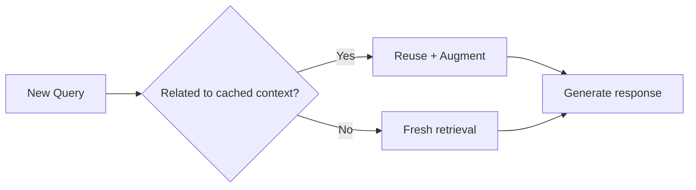

# Conversation Flows

Standard workflows for MCP-enabled documentation interactions.

---

## Overview

All AI interactions follow documentation-driven workflows:



---

## Standard Flows

### 1. Feature Implementation Request

For requests like "Implement the booking confirmation email":



---

### 2. API Endpoint Query

For requests like "What endpoints exist for trips?":



---

### 3. Documentation Gap Handling

When documentation is missing:



---

### 4. Customer Chat Inquiry

For tourist inquiries in the chat widget:



---

### 5. Validation and Review Flow

For code review against documentation:



---

## Error Handling Flows

### Insufficient Context



### Conflicting Documentation



---

## Context Persistence

### Session State

```json
{
  "session_id": "sess_abc123",
  "user_id": "user_456",
  "message_history": [...],
  "retrieved_context": {
    "docs/api/trips.md": { "cached_at": "...", "sections": [...] },
    "docs/requirements/functional.md": { "cached_at": "...", "sections": [...] }
  },
  "active_tasks": [],
  "escalation_status": null
}
```

### Context Reuse

Within a session, relevant documentation is cached:



---

## Flow Metrics

| Flow Type | Avg Response Time | Doc Queries | Success Rate |
|-----------|-------------------|-------------|--------------|
| Feature Implementation | 5-10s | 3-5 | 95% |
| API Query | 2-3s | 1-2 | 99% |
| Gap Detection | 3-5s | 2-4 | 100% |
| Customer Chat | 2-4s | 1-3 | 92% |
| Validation | 4-6s | 2-3 | 98% |
