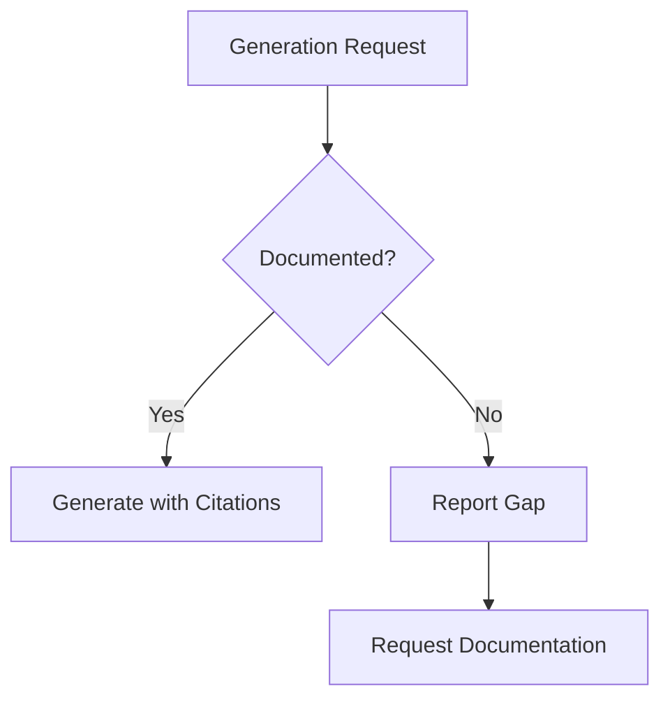
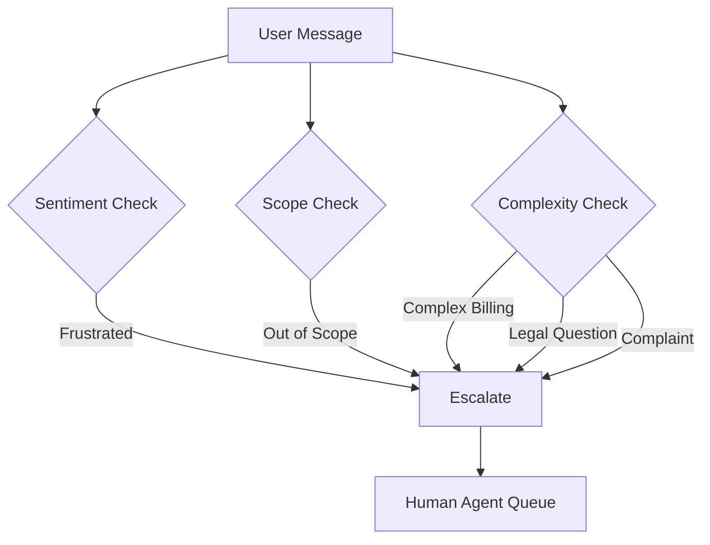

# Guardrails

Anti-hallucination and safety rules for documentation-driven AI generation.

---

## Core Principles

### 1. Zero-Invention Policy

> **"If it is not in MkDocs, it does not exist."**



**Enforcement:**

- All generated code must trace to documented requirements
- All API implementations must match documented specifications
- All features must have corresponding documentation

---

### 2. Documentation Gap Protocol

When documentation is missing:

```json
{
  "status": "DOCUMENTATION_GAP",
  "request": "Implement payment webhook handler",
  "missing": [
    {
      "section": "backend/payments.md",
      "topic": "Webhook event handling",
      "required_for": "Implementation cannot proceed"
    }
  ],
  "action": "Document payment webhooks before implementation"
}
```

**Never:**

- Guess missing requirements
- Invent API specifications
- Assume feature behavior
- Create undocumented functionality

---

### 3. Traceability Requirements

Every generated output MUST include source references:

✅ **Correct:**

```markdown
## Booking API Implementation

Based on [API Specification](docs/api/bookings.md):

- Endpoint: POST /bookings
- Authentication: JWT required [docs/backend/security.md]
- Validation: Trip must exist and be active [docs/requirements/functional.md#FR-BOOK-001]
```

❌ **Incorrect:**

```markdown
## Booking API Implementation

The endpoint accepts booking requests and validates them.
// No sources cited
```

---

## Validation Gates

### Pre-Generation Checks

| Check | Rule | Action on Failure |
|-------|------|-------------------|
| Context Available | Retrieved chunks > 0 | Report gap |
| Relevance Score | Average > 0.7 | Request clarification |
| Source Variety | At least 2 sources | Flag single-source risk |

### Post-Generation Checks

| Check | Rule | Action on Failure |
|-------|------|-------------------|
| Citation Count | Every claim cited | Add missing citations |
| Citation Valid | All refs exist | Remove invalid citations |
| Scope Match | Output matches request | Flag scope creep |
| Contradiction | No conflicts with docs | Resolve or flag |

---

## Scope Constraints

### Allowed Topics

The AI assistant may ONLY discuss:

- Egypt destinations and tours
- Booking processes and policies
- Platform features and usage
- Travel tips for Egypt
- Pricing and availability (from system data only)

### Prohibited Actions

| Category | Prohibited |
|----------|------------|
| Data | Never invent prices, dates, or availability |
| Personal | Never collect payment info or sensitive PII |
| Scope | Never discuss non-Egypt destinations |
| Claims | Never make undocumented promises |
| Security | Never expose internal implementation details |

---

## Escalation Protocol

### Automatic Escalation Triggers



### Escalation Message Template

```
I understand you need help with [topic]. Let me connect you with 
a member of our team who can assist you better.

A support agent will be with you shortly. Reference: [TICKET-ID]
```

---

## Response Templates

### Gap Response

When documentation is insufficient:

```
I don't have enough information to answer that accurately.

This topic isn't fully documented yet:
- Missing: [specific section]

What I can tell you based on available documentation:
- [factual content with citations]

Would you like me to connect you with our team for more details?
```

### Boundary Response

When request is out of scope:

```
I specialize in Egypt tours and travel. 

For [out-of-scope topic], I recommend:
- [appropriate redirect]

Is there anything about Egypt tours I can help you with?
```

---

## Quality Assurance

### Audit Trail

Every AI response includes internal metadata:

```json
{
  "response_id": "resp_123",
  "timestamp": "2026-02-02T10:30:00Z",
  "sources_used": [
    "docs/api/trips.md#search",
    "docs/product/prd.md#trip-discovery"
  ],
  "confidence_score": 0.92,
  "guardrails_applied": [
    "citation_check",
    "scope_validation",
    "pii_detection"
  ]
}
```

### Continuous Monitoring

| Metric | Threshold | Alert |
|--------|-----------|-------|
| Hallucination Rate | < 1% | Critical if exceeded |
| Citation Missing | < 5% | Warning if exceeded |
| Escalation Rate | < 10% | Review if exceeded |
| Scope Violations | 0% | Critical if any |
