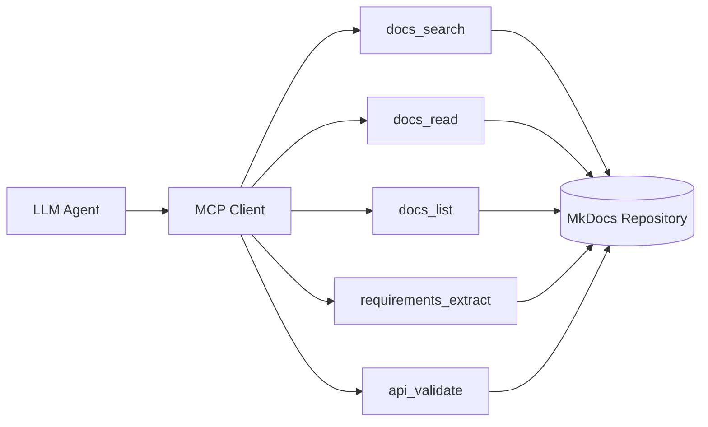

# MCP Tools Reference

Complete MCP (Model Context Protocol) tool definitions for the Egypt Tours Platform documentation system.

---

## Overview

These tools enable LLM agents to interact with the MkDocs documentation as the **single source of truth**. All tools follow the MCP specification and enforce documentation-driven development.



---

## Tool Definitions

### `docs_search`

Semantic search across the entire documentation repository.

```json
{
  "name": "docs_search",
  "description": "Search documentation for relevant content. Returns matching sections with file paths and relevance scores.",
  "inputSchema": {
    "type": "object",
    "properties": {
      "query": {
        "type": "string",
        "description": "Search query (natural language or keywords)"
      },
      "sections": {
        "type": "array",
        "items": {
          "type": "string",
          "enum": ["product", "requirements", "ux", "frontend", "backend", "api", "admin", "ai", "devops", "testing", "release", "migration", "postman"]
        },
        "description": "Optional: Limit search to specific documentation sections"
      },
      "language": {
        "type": "string",
        "enum": ["en", "es", "ar"],
        "default": "en",
        "description": "Preferred language for results"
      },
      "limit": {
        "type": "integer",
        "default": 10,
        "minimum": 1,
        "maximum": 50,
        "description": "Maximum number of results to return"
      }
    },
    "required": ["query"]
  }
}
```

**Example Usage:**

```json
{
  "query": "JWT authentication flow",
  "sections": ["backend", "api"],
  "limit": 5
}
```

**Example Response:**

```json
{
  "results": [
    {
      "file": "docs/backend/authentication.md",
      "section": "JWT Strategy",
      "content": "The platform uses JWT tokens for stateless authentication...",
      "relevance": 0.95
    },
    {
      "file": "docs/api/auth.md",
      "section": "POST /auth/login",
      "content": "Returns a JWT token upon successful authentication...",
      "relevance": 0.88
    }
  ],
  "total": 2
}
```

---

### `docs_read`

Read the complete content of a specific documentation file.

```json
{
  "name": "docs_read",
  "description": "Read the full content of a documentation file. Returns markdown content with metadata.",
  "inputSchema": {
    "type": "object",
    "properties": {
      "path": {
        "type": "string",
        "description": "Relative path to the documentation file (e.g., 'api/auth.md')"
      },
      "section": {
        "type": "string",
        "description": "Optional: Specific heading/section within the file to extract"
      }
    },
    "required": ["path"]
  }
}
```

**Example Usage:**

```json
{
  "path": "backend/authentication.md",
  "section": "JWT Strategy"
}
```

---

### `docs_list`

List available documentation sections and files.

```json
{
  "name": "docs_list",
  "description": "List documentation structure. Returns available sections and files.",
  "inputSchema": {
    "type": "object",
    "properties": {
      "section": {
        "type": "string",
        "description": "Optional: Specific section to list (e.g., 'api', 'backend')"
      },
      "include_headings": {
        "type": "boolean",
        "default": false,
        "description": "Include top-level headings from each file"
      }
    }
  }
}
```

**Example Response:**

```json
{
  "sections": [
    {
      "name": "api",
      "files": [
        {"path": "api/index.md", "title": "API Overview"},
        {"path": "api/auth.md", "title": "Authentication"},
        {"path": "api/trips.md", "title": "Trips"},
        {"path": "api/bookings.md", "title": "Bookings"}
      ]
    }
  ]
}
```

---

### `requirements_extract`

Extract structured requirements from documentation.

```json
{
  "name": "requirements_extract",
  "description": "Extract requirements relevant to a feature or component. Returns categorized requirements with source references.",
  "inputSchema": {
    "type": "object",
    "properties": {
      "feature": {
        "type": "string",
        "description": "Feature or component name to extract requirements for"
      },
      "types": {
        "type": "array",
        "items": {
          "type": "string",
          "enum": ["functional", "non-functional", "security", "localization", "ux", "api"]
        },
        "default": ["functional", "non-functional"],
        "description": "Types of requirements to extract"
      }
    },
    "required": ["feature"]
  }
}
```

**Example Usage:**

```json
{
  "feature": "booking",
  "types": ["functional", "security", "api"]
}
```

**Example Response:**

```json
{
  "feature": "booking",
  "requirements": {
    "functional": [
      {
        "id": "FR-BOOK-001",
        "description": "Users can request a booking for available trips",
        "source": "docs/requirements/functional.md#booking"
      }
    ],
    "security": [
      {
        "id": "SEC-BOOK-001",
        "description": "Booking creation requires authenticated user",
        "source": "docs/backend/security.md#authorization"
      }
    ],
    "api": [
      {
        "id": "API-BOOK-001",
        "description": "POST /bookings - Create new booking",
        "source": "docs/api/bookings.md#create-booking"
      }
    ]
  }
}
```

---

### `api_validate`

Validate API implementation against documentation.

```json
{
  "name": "api_validate",
  "description": "Validate that an API endpoint implementation matches documentation specifications.",
  "inputSchema": {
    "type": "object",
    "properties": {
      "endpoint": {
        "type": "string",
        "description": "API endpoint path (e.g., '/auth/login')"
      },
      "method": {
        "type": "string",
        "enum": ["GET", "POST", "PUT", "PATCH", "DELETE"],
        "description": "HTTP method"
      },
      "implementation": {
        "type": "object",
        "description": "Implementation details to validate (request/response schemas)"
      }
    },
    "required": ["endpoint", "method"]
  }
}
```

---

### `context_build`

Build a comprehensive context map for generation tasks.

```json
{
  "name": "context_build",
  "description": "Build a context map from documentation for a specific generation task. Aggregates relevant requirements, API specs, architecture constraints, and rules.",
  "inputSchema": {
    "type": "object",
    "properties": {
      "task": {
        "type": "string",
        "description": "Description of the generation task"
      },
      "components": {
        "type": "array",
        "items": {
          "type": "string"
        },
        "description": "Components/features involved in the task"
      },
      "include": {
        "type": "array",
        "items": {
          "type": "string",
          "enum": ["requirements", "api", "architecture", "security", "localization", "ux"]
        },
        "default": ["requirements", "api", "architecture"],
        "description": "Types of context to include"
      }
    },
    "required": ["task"]
  }
}
```

**Example Usage:**

```json
{
  "task": "Implement user registration endpoint",
  "components": ["auth", "users"],
  "include": ["requirements", "api", "security", "localization"]
}
```

---

## Usage Guidelines

### Mandatory Workflow

Every generation task MUST follow this pipeline:

```
1. docs_list      → Identify relevant sections
2. docs_search    → Find specific content
3. docs_read      → Load full context
4. context_build  → Aggregate requirements
5. [Generate]     → Create artifact
6. api_validate   → Validate if API-related
```

### Traceability Requirements

All generated outputs MUST cite documentation sources:

```markdown
## References

Implemented according to:
- [authentication.md](docs/backend/authentication.md) → JWT Strategy
- [auth.md](docs/api/auth.md) → POST /auth/login
- [security.md](docs/backend/security.md) → Token Policy
```

### Gap Protocol

If documentation is missing, tools will return:

```json
{
  "error": "DOCUMENTATION_GAP",
  "missing": {
    "section": "backend/payments.md",
    "topic": "Payment gateway integration"
  },
  "action_required": "Document payment gateway requirements before implementation"
}
```

---

## Language Support

All tools support multilingual documentation:

| Language | Code | RTL |
|----------|------|-----|
| English  | `en` | No  |
| Spanish  | `es` | No  |
| Arabic   | `ar` | Yes |

When `language` parameter is specified, tools will:

1. Prefer localized content if available
2. Fall back to English
3. Include language metadata in responses
