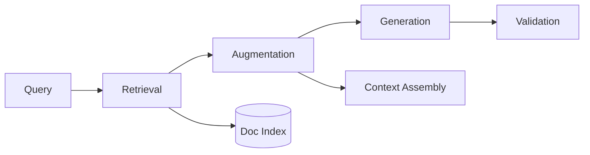
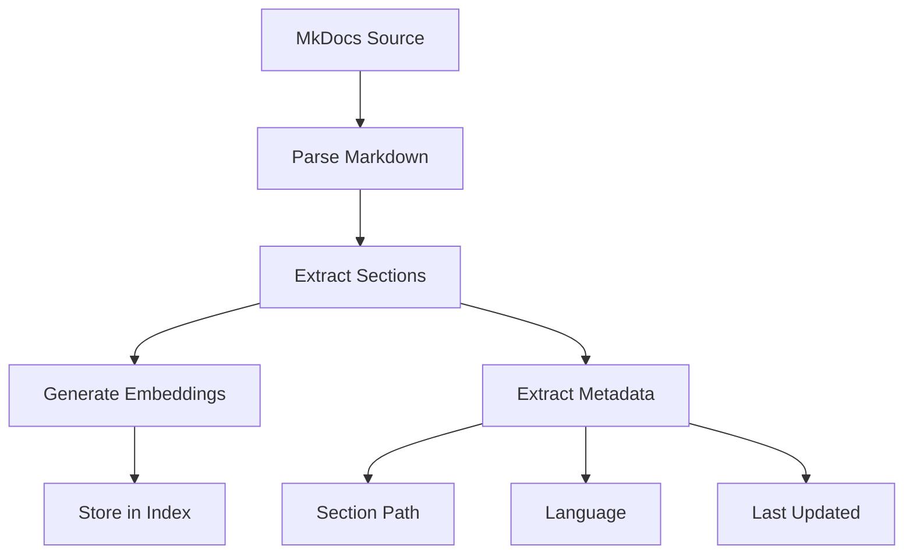
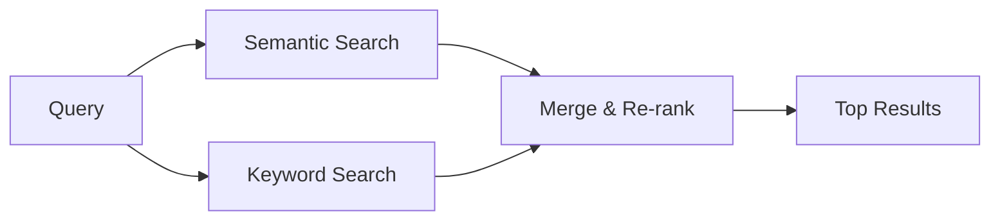

# RAG Strategy

Retrieval-Augmented Generation implementation for the Egypt Tours documentation system.

---

## Overview

RAG ensures all AI-generated content is grounded in documentation:



---

## Indexing Strategy

### Document Processing Pipeline



### Chunking Configuration

| Parameter | Value | Rationale |
|-----------|-------|-----------|
| Chunk Size | 1000 tokens | Balances context coverage with retrieval precision |
| Chunk Overlap | 200 tokens | Ensures cross-chunk context continuity |
| Heading Preservation | Always | Maintains document structure for citations |

### Metadata Extraction

Each chunk includes:

```json
{
  "content": "...",
  "metadata": {
    "source": "docs/api/bookings.md",
    "section": "Create Booking",
    "section_path": ["API", "Bookings", "Create Booking"],
    "language": "en",
    "last_modified": "2026-01-15",
    "tags": ["api", "booking", "POST"]
  }
}
```

---

## Retrieval Process

### Semantic Search

1. **Query Embedding**: Convert user query to vector
2. **Similarity Search**: Find top-k similar chunks
3. **Metadata Filtering**: Apply section/language filters
4. **Re-ranking**: Score by relevance and recency

### Hybrid Search

Combines semantic and keyword search:



---

## Augmentation

### Context Assembly

Retrieved chunks are assembled into structured context:

```markdown
## Retrieved Context

### Source: docs/api/bookings.md#create-booking
POST /bookings creates a new booking request...

### Source: docs/requirements/functional.md#booking
FR-BOOK-001: Users can request bookings for available trips...

### Source: docs/backend/security.md#authorization
Booking creation requires authenticated user with CUSTOMER role...
```

### Context Window Management

| Priority | Content Type | Max Tokens |
|----------|--------------|------------|
| 1 | Directly matching requirements | 2000 |
| 2 | Related API specifications | 1500 |
| 3 | Architecture constraints | 1000 |
| 4 | Supporting documentation | 500 |

---

## Generation Guidelines

### Prompt Template

```
You are generating code/documentation for the Egypt Tours Platform.

CONTEXT FROM DOCUMENTATION:
{retrieved_context}

GENERATION RULES:
1. Use ONLY information from the provided context
2. If context is insufficient, report what's missing
3. Include citations for every claim
4. Follow architecture patterns from context

USER REQUEST:
{user_request}

Generate the requested output with proper citations.
```

---

## Citation Strategy

### Citation Format

All generated content includes references:

```markdown
## Implementation

The booking endpoint accepts the following payload [1]:

```json
{
  "tripId": "number",
  "date": "string (ISO 8601)",
  "travelers": "number"
}
```

Authentication is required via JWT token [2].

---

## References

[1] docs/api/bookings.md#request-body
[2] docs/backend/authentication.md#jwt-strategy

```

### Citation Validation

Every citation must:
- Reference an existing documentation file
- Point to a specific section (when possible)
- Be verifiable via `docs_read` tool

---

## Language Handling

### Multilingual Retrieval

1. Detect query language
2. Search in matching language index
3. Fall back to English if no matches
4. Include language metadata in results

### Index Structure

```

index/
├── en/           # English index (primary)
├── es/           # Spanish index
└── ar/           # Arabic index (RTL)

```

---

## Quality Metrics

| Metric | Target | Measurement |
|--------|--------|-------------|
| Retrieval Precision | > 90% | % of retrieved chunks that are relevant |
| Citation Accuracy | 100% | All citations point to valid sources |
| Context Coverage | > 85% | % of generated claims backed by context |
| Hallucination Rate | < 1% | Claims without documentation support |
