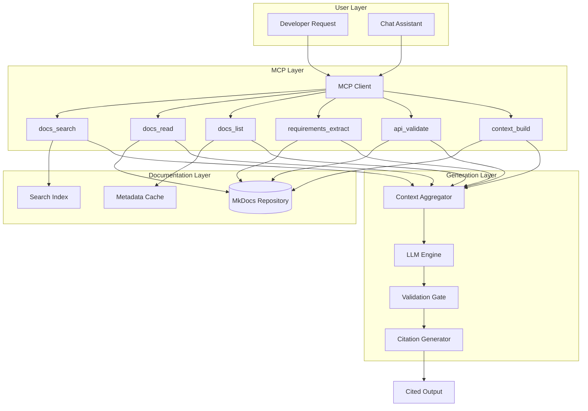
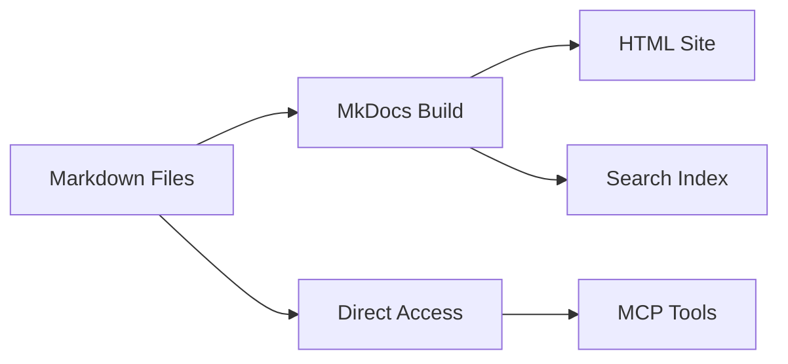
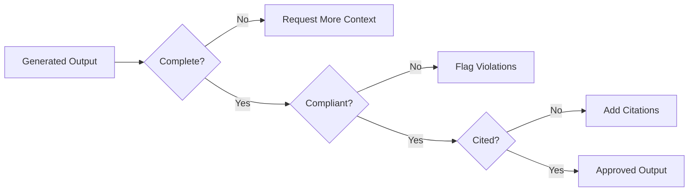
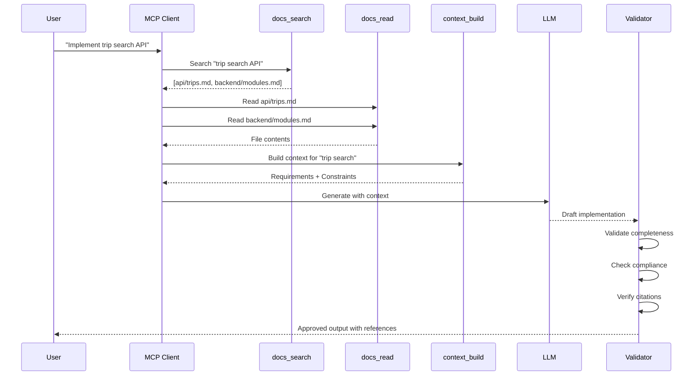
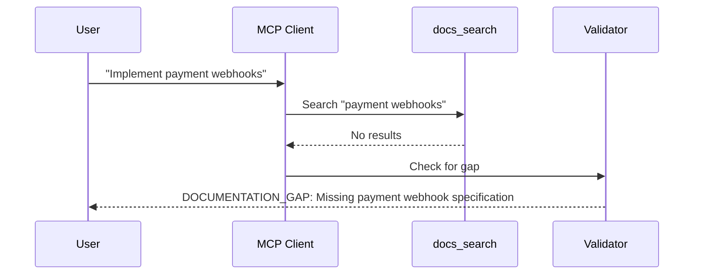

# System Design

MCP-enabled architecture for documentation-driven AI interactions.

---

## Architecture Overview



---

## Components

### MCP Client

The orchestration layer that routes requests to appropriate tools:

| Responsibility | Description |
|----------------|-------------|
| Tool Selection | Determines which MCP tools to invoke based on request |
| Parallel Execution | Runs independent tool calls concurrently |
| Response Aggregation | Combines tool outputs into unified context |
| Error Handling | Manages tool failures and gap detection |

### Documentation Layer



| Component | Purpose |
|-----------|---------|
| MkDocs Repository | Source markdown files in `docs/` |
| Search Index | Lunr.js index generated by MkDocs |
| Metadata Cache | Pre-computed file metadata and headings |

### Context Aggregator

Builds comprehensive context maps for generation:

```yaml
context_map:
  task: "Implement booking confirmation email"
  sections:
    - requirements:
        source: docs/requirements/functional.md
        items: [FR-BOOK-005, FR-EMAIL-001]
    - api:
        source: docs/api/bookings.md
        endpoints: [GET /bookings/{id}]
    - localization:
        source: docs/frontend/i18n.md
        keys: [email.booking.confirmed.*]
```

### Validation Gate

Pre-output compliance checks:



---

## Request Flow

### Standard Generation Request



### Gap Detection Flow



---

## Integration Points

### Frontend Chat Widget

```typescript
// React component integration
const ChatWidget = () => {
  const sendMessage = async (message: string) => {
    const response = await fetch('/api/chat', {
      method: 'POST',
      body: JSON.stringify({
        message,
        context: { useMCP: true }
      })
    });
    // Response includes citations from docs
  };
};
```

### Backend Chat Service

```java
@Service
public class ChatService {
    
    private final MCPClient mcpClient;
    private final LLMProvider llmProvider;
    
    public ChatResponse process(ChatRequest request) {
        // 1. Build context via MCP
        Context ctx = mcpClient.buildContext(request.getMessage());
        
        // 2. Generate with LLM
        String response = llmProvider.generate(ctx);
        
        // 3. Validate and cite
        return validator.validateAndCite(response, ctx);
    }
}
```

---

## Multilingual Support

All documentation operations support three languages:

| Language | Code | Index | RTL Support |
|----------|------|-------|-------------|
| English | `en` | Primary | No |
| Spanish | `es` | Secondary | No |
| Arabic | `ar` | Secondary | Yes |

Language selection follows this priority:

1. Explicit `language` parameter
2. User's `Accept-Language` header
3. Default to English
