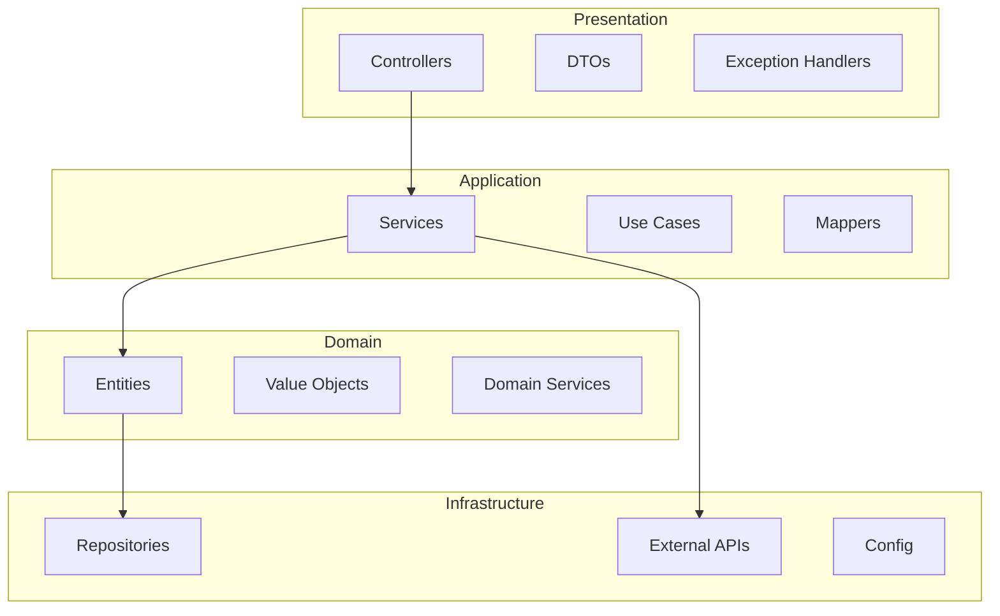

# Backend Documentation

This section covers the Java Spring Boot backend architecture and implementation.

---

## Contents

| Document | Description |
|----------|-------------|
| [Clean Architecture](clean-architecture.md) | Layered architecture design |
| [Modules](modules.md) | Domain modules breakdown |
| [Authentication](authentication.md) | JWT and OAuth implementation |
| [Security](security.md) | Security measures and policies |
| [Database](database.md) | Data model and ERD |
| [Migrations](migrations.md) | Database migration strategy |

---

## Tech Stack

| Component | Technology |
|-----------|------------|
| Framework | Spring Boot 3.x |
| Language | Java 21 |
| Build | Gradle |
| Database | PostgreSQL |
| ORM | Spring Data JPA / Hibernate |
| Auth | Spring Security + JWT |
| API Docs | OpenAPI 3 / Springdoc |
| Validation | Jakarta Validation |
| Email | Spring Mail |
| Cache | Redis |
| Storage | AWS S3 / Cloudinary |

---

## Architecture Overview

