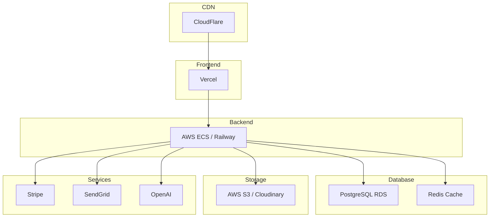

# DevOps

This section covers deployment, CI/CD, and infrastructure.

---

## Contents

| Document | Description |
|----------|-------------|
| [Infrastructure](infrastructure.md) | Cloud infrastructure |
| [CI/CD](ci-cd.md) | Pipeline configuration |
| [Monitoring](monitoring.md) | Observability setup |
| [Deployment](deployment.md) | Deployment procedures |
| [Environment Variables](env-vars.md) | Configuration management |

---

## Infrastructure Overview

