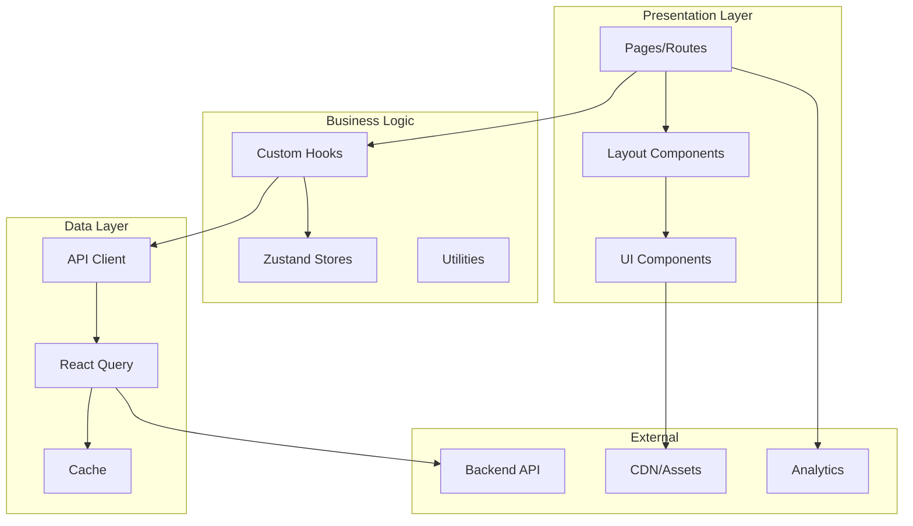
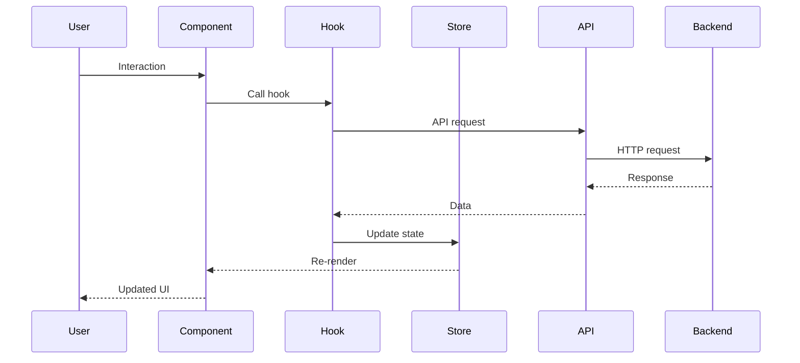

# Frontend Architecture

## Overview

The frontend follows a modular, feature-based architecture optimized for SSR/SSG and SEO performance.

---

## Architecture Diagram



---

## Directory Structure

```
src/
├── app/                    # Next.js App Router or pages
│   ├── [locale]/           # Localized routes
│   │   ├── page.tsx        # Home
│   │   ├── trips/          # Trip routes
│   │   ├── destinations/   # Destination routes
│   │   ├── booking/        # Booking flow
│   │   ├── blog/           # Blog routes
│   │   ├── account/        # Customer portal
│   │   └── admin/          # Admin routes
│   ├── api/                # API routes (if needed)
│   └── layout.tsx          # Root layout
│
├── components/
│   ├── ui/                 # Base UI components
│   │   ├── Button/
│   │   ├── Card/
│   │   ├── Modal/
│   │   └── ...
│   ├── common/             # Shared components
│   │   ├── Header/
│   │   ├── Footer/
│   │   ├── Navbar/
│   │   └── ...
│   ├── trips/              # Trip-related components
│   ├── booking/            # Booking components
│   ├── auth/               # Auth components
│   └── admin/              # Admin components
│
├── hooks/
│   ├── useAuth.ts
│   ├── useTrips.ts
│   ├── useBooking.ts
│   ├── useWishlist.ts
│   └── ...
│
├── stores/
│   ├── authStore.ts
│   ├── bookingStore.ts
│   ├── cartStore.ts
│   ├── uiStore.ts
│   └── index.ts
│
├── lib/
│   ├── api/
│   │   ├── client.ts       # Axios instance
│   │   ├── trips.ts        # Trip API
│   │   ├── bookings.ts     # Booking API
│   │   └── ...
│   ├── utils/
│   │   ├── formatting.ts
│   │   ├── validation.ts
│   │   └── ...
│   └── constants.ts
│
├── types/
│   ├── trip.ts
│   ├── booking.ts
│   ├── user.ts
│   └── api.ts
│
├── locales/
│   ├── en/
│   ├── es/
│   └── ar/
│
├── styles/
│   ├── globals.css
│   ├── variables.css
│   └── components/
│
└── public/
    ├── images/
    ├── icons/
    └── fonts/
```

---

## Key Patterns

### Component Pattern

```tsx
// components/trips/TripCard/TripCard.tsx
interface TripCardProps {
  trip: Trip;
  onWishlist?: (id: string) => void;
}

export const TripCard: FC<TripCardProps> = ({ trip, onWishlist }) => {
  const { t } = useTranslation();
  
  return (
    <Card className={styles.tripCard}>
      <Image src={trip.thumbnail} alt={trip.title} />
      <CardContent>
        <h3>{trip.title}</h3>
        <Rating value={trip.rating} />
        <Price amount={trip.price} currency={trip.currency} />
        <Button onClick={() => onWishlist?.(trip.id)}>
          {t('addToWishlist')}
        </Button>
      </CardContent>
    </Card>
  );
};
```

### Hook Pattern

```tsx
// hooks/useTrips.ts
export const useTrips = (filters: TripFilters) => {
  return useQuery({
    queryKey: ['trips', filters],
    queryFn: () => tripsApi.getTrips(filters),
    staleTime: 5 * 60 * 1000, // 5 minutes
  });
};
```

### Store Pattern

```tsx
// stores/bookingStore.ts
interface BookingState {
  selectedTrip: Trip | null;
  date: Date | null;
  travelers: TravelerCount;
  setTrip: (trip: Trip) => void;
  setDate: (date: Date) => void;
  reset: () => void;
}

export const useBookingStore = create<BookingState>((set) => ({
  selectedTrip: null,
  date: null,
  travelers: { adults: 1, children: 0, infants: 0 },
  setTrip: (trip) => set({ selectedTrip: trip }),
  setDate: (date) => set({ date }),
  reset: () => set({ selectedTrip: null, date: null, travelers: { adults: 1, children: 0, infants: 0 } }),
}));
```

---

## Data Flow



---

## Environment Configuration

```bash
# .env.local
NEXT_PUBLIC_API_URL=https://api.egypttours.com
NEXT_PUBLIC_GOOGLE_ANALYTICS=G-XXXXXXXXXX
NEXT_PUBLIC_STRIPE_KEY=pk_live_xxxxx
NEXT_PUBLIC_DEFAULT_LOCALE=en
```

---

## Build Configuration

```typescript
// next.config.ts
import type { NextConfig } from 'next';

const config: NextConfig = {
  i18n: {
    locales: ['en', 'es', 'ar'],
    defaultLocale: 'en',
  },
  images: {
    domains: ['cdn.egypttours.com'],
  },
  experimental: {
    optimizeCss: true,
  },
};

export default config;
```
