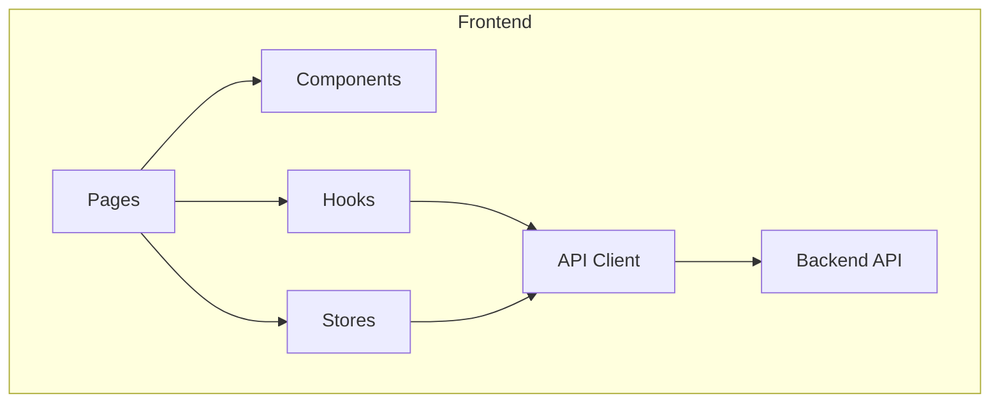

# Frontend Documentation

This section covers the React frontend architecture, state management, and implementation details.

---

## Contents

| Document | Description |
|----------|-------------|
| [Architecture](architecture.md) | Overall frontend structure |
| [React Structure](react-structure.md) | Component organization |
| [Zustand Stores](zustand-stores.md) | State management |
| [Routing](routing.md) | Navigation and routes |
| [Internationalization](i18n.md) | Multi-language support |
| [SSR & SEO](ssr-seo.md) | Server rendering and optimization |
| [Components](components.md) | Component library |

---

## Tech Stack

| Technology | Purpose |
|------------|---------|
| React 18+ | UI framework |
| TypeScript | Type safety |
| Zustand | State management |
| React Router | Routing |
| Next.js / Vite | Build & SSR |
| Axios | HTTP client |
| React Query | Server state |
| i18next | Internationalization |

---

## Architecture Overview

