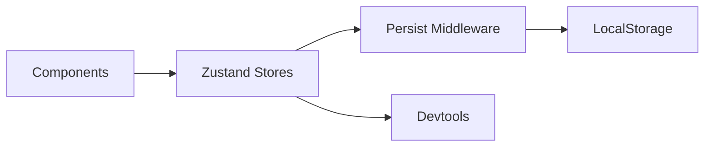

# Zustand Stores

## Overview

State management uses Zustand for its simplicity and performance. Stores are organized by domain.

---

## Store Architecture



---

## Store Definitions

### Auth Store

```typescript
// stores/authStore.ts
import { create } from 'zustand';
import { persist, devtools } from 'zustand/middleware';
import type { User } from '@/types';

interface AuthState {
  user: User | null;
  token: string | null;
  refreshToken: string | null;
  isAuthenticated: boolean;
  isLoading: boolean;
  
  // Actions
  setAuth: (user: User, token: string, refreshToken: string) => void;
  updateUser: (user: Partial<User>) => void;
  logout: () => void;
  setLoading: (loading: boolean) => void;
}

export const useAuthStore = create<AuthState>()(
  devtools(
    persist(
      (set) => ({
        user: null,
        token: null,
        refreshToken: null,
        isAuthenticated: false,
        isLoading: true,

        setAuth: (user, token, refreshToken) =>
          set({
            user,
            token,
            refreshToken,
            isAuthenticated: true,
            isLoading: false,
          }),

        updateUser: (userData) =>
          set((state) => ({
            user: state.user ? { ...state.user, ...userData } : null,
          })),

        logout: () =>
          set({
            user: null,
            token: null,
            refreshToken: null,
            isAuthenticated: false,
          }),

        setLoading: (loading) => set({ isLoading: loading }),
      }),
      {
        name: 'auth-storage',
        partialize: (state) => ({
          token: state.token,
          refreshToken: state.refreshToken,
        }),
      }
    ),
    { name: 'AuthStore' }
  )
);
```

### Booking Store

```typescript
// stores/bookingStore.ts
import { create } from 'zustand';
import { devtools } from 'zustand/middleware';
import type { Trip, TravelerDetails } from '@/types';

interface TravelerCount {
  adults: number;
  children: number;
  infants: number;
}

interface BookingState {
  // State
  trip: Trip | null;
  date: Date | null;
  travelers: TravelerCount;
  addOns: string[];
  travelerDetails: TravelerDetails[];
  step: number;
  
  // Computed
  totalPrice: number;
  
  // Actions
  setTrip: (trip: Trip) => void;
  setDate: (date: Date) => void;
  setTravelers: (travelers: TravelerCount) => void;
  addAddOn: (id: string) => void;
  removeAddOn: (id: string) => void;
  setTravelerDetails: (details: TravelerDetails[]) => void;
  nextStep: () => void;
  prevStep: () => void;
  goToStep: (step: number) => void;
  reset: () => void;
}

const initialState = {
  trip: null,
  date: null,
  travelers: { adults: 1, children: 0, infants: 0 },
  addOns: [],
  travelerDetails: [],
  step: 0,
  totalPrice: 0,
};

export const useBookingStore = create<BookingState>()(
  devtools(
    (set, get) => ({
      ...initialState,

      setTrip: (trip) => set({ trip }),

      setDate: (date) => set({ date }),

      setTravelers: (travelers) => {
        const { trip } = get();
        const total = trip
          ? trip.price * travelers.adults + trip.price * 0.7 * travelers.children
          : 0;
        set({ travelers, totalPrice: total });
      },

      addAddOn: (id) =>
        set((state) => ({ addOns: [...state.addOns, id] })),

      removeAddOn: (id) =>
        set((state) => ({
          addOns: state.addOns.filter((a) => a !== id),
        })),

      setTravelerDetails: (details) => set({ travelerDetails: details }),

      nextStep: () => set((state) => ({ step: state.step + 1 })),

      prevStep: () => set((state) => ({ step: Math.max(0, state.step - 1) })),

      goToStep: (step) => set({ step }),

      reset: () => set(initialState),
    }),
    { name: 'BookingStore' }
  )
);
```

### UI Store

```typescript
// stores/uiStore.ts
import { create } from 'zustand';

interface UIState {
  // Modals
  isLoginModalOpen: boolean;
  isSearchOpen: boolean;
  isMobileMenuOpen: boolean;
  
  // Theme
  theme: 'light' | 'dark';
  locale: 'en' | 'es' | 'ar';
  
  // Actions
  openLoginModal: () => void;
  closeLoginModal: () => void;
  toggleSearch: () => void;
  toggleMobileMenu: () => void;
  setTheme: (theme: 'light' | 'dark') => void;
  setLocale: (locale: 'en' | 'es' | 'ar') => void;
}

export const useUIStore = create<UIState>((set) => ({
  isLoginModalOpen: false,
  isSearchOpen: false,
  isMobileMenuOpen: false,
  theme: 'light',
  locale: 'en',

  openLoginModal: () => set({ isLoginModalOpen: true }),
  closeLoginModal: () => set({ isLoginModalOpen: false }),
  toggleSearch: () => set((state) => ({ isSearchOpen: !state.isSearchOpen })),
  toggleMobileMenu: () => set((state) => ({ isMobileMenuOpen: !state.isMobileMenuOpen })),
  setTheme: (theme) => set({ theme }),
  setLocale: (locale) => set({ locale }),
}));
```

### Wishlist Store

```typescript
// stores/wishlistStore.ts
import { create } from 'zustand';
import { persist } from 'zustand/middleware';

interface WishlistState {
  items: string[]; // Trip IDs
  
  addItem: (id: string) => void;
  removeItem: (id: string) => void;
  toggleItem: (id: string) => void;
  isInWishlist: (id: string) => boolean;
  clear: () => void;
}

export const useWishlistStore = create<WishlistState>()(
  persist(
    (set, get) => ({
      items: [],

      addItem: (id) =>
        set((state) => ({
          items: state.items.includes(id) ? state.items : [...state.items, id],
        })),

      removeItem: (id) =>
        set((state) => ({
          items: state.items.filter((item) => item !== id),
        })),

      toggleItem: (id) => {
        const { items, addItem, removeItem } = get();
        items.includes(id) ? removeItem(id) : addItem(id);
      },

      isInWishlist: (id) => get().items.includes(id),

      clear: () => set({ items: [] }),
    }),
    { name: 'wishlist-storage' }
  )
);
```

---

## Store Summary

| Store | Persisted | Purpose |
|-------|-----------|---------|
| `authStore` | Token only | Authentication state |
| `bookingStore` | No | Booking flow state |
| `uiStore` | No | UI state (modals, theme) |
| `wishlistStore` | Yes | Saved trips |
| `filterStore` | Session | Search filters |
| `cartStore` | Session | Shopping cart |

---

## Usage Examples

```tsx
// Reading state
const { user, isAuthenticated } = useAuthStore();

// Updating state
const { setTrip, nextStep } = useBookingStore();

// Selective subscription (performance)
const token = useAuthStore((state) => state.token);

// With shallow comparison
import { shallow } from 'zustand/shallow';
const { travelers, date } = useBookingStore(
  (state) => ({ travelers: state.travelers, date: state.date }),
  shallow
);
```
