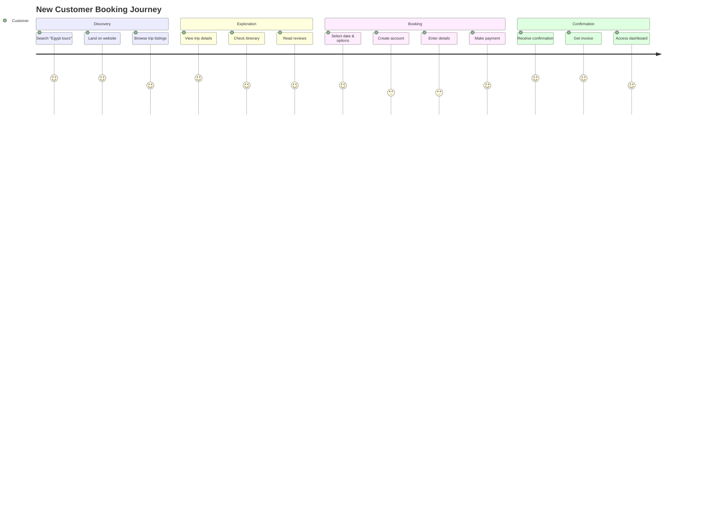
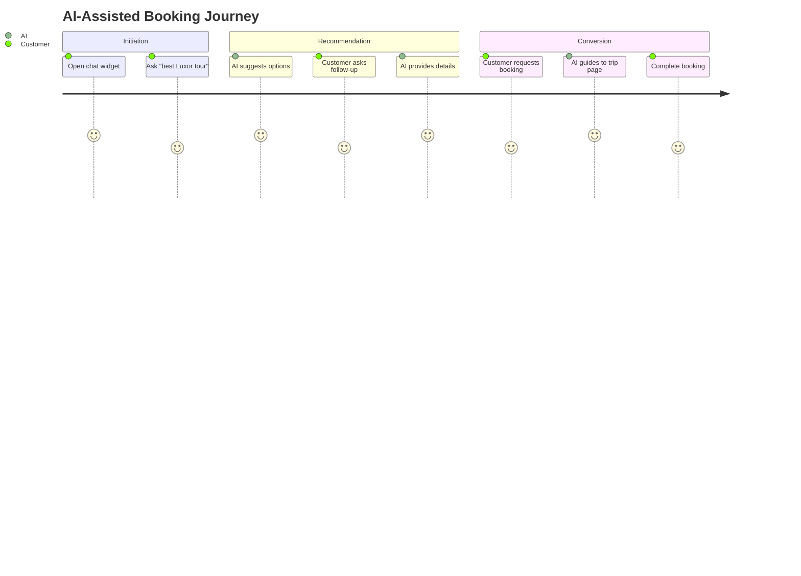
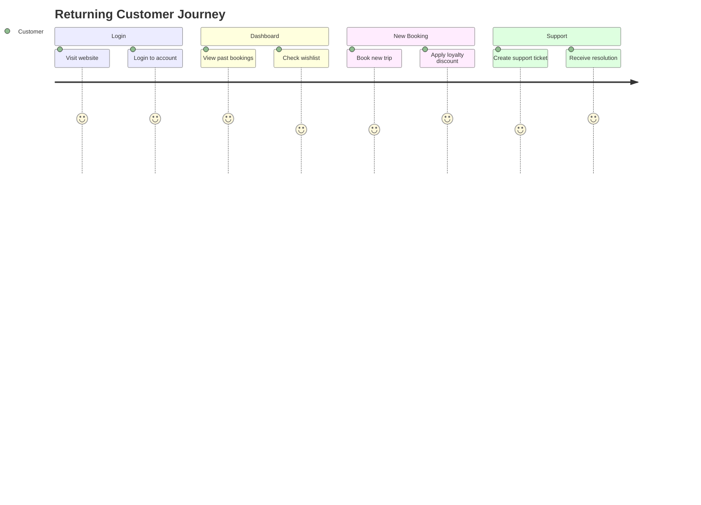
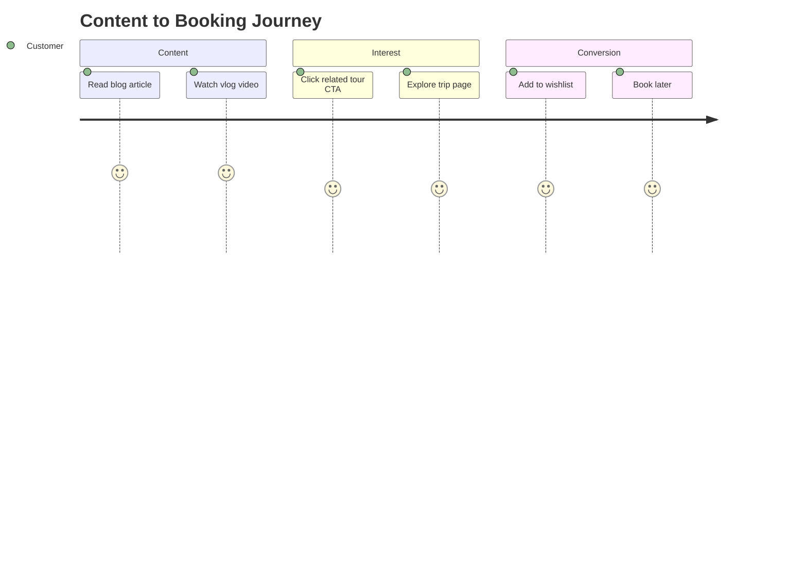
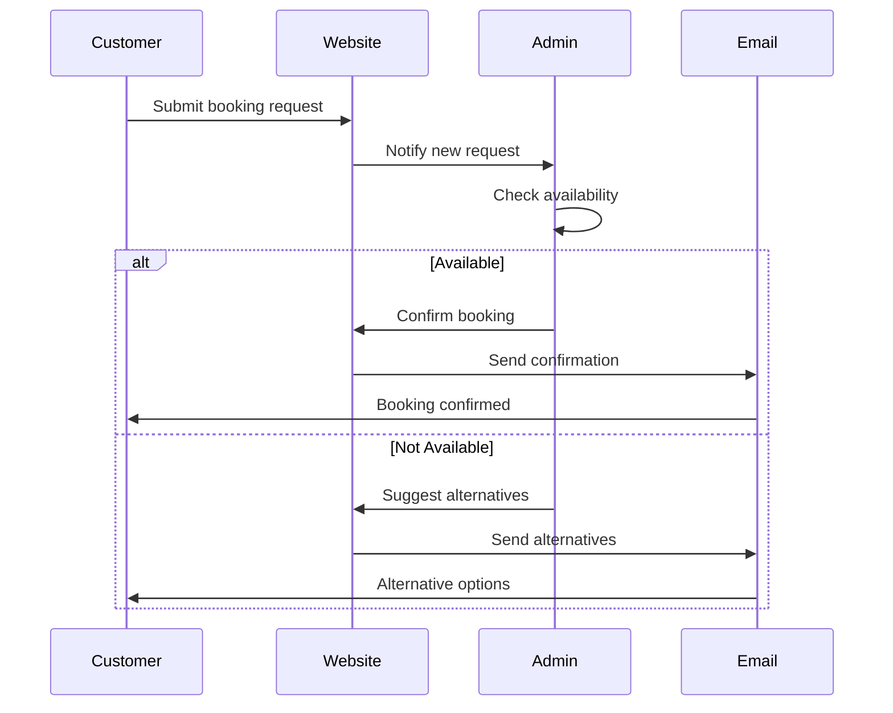

# Customer Journeys

## Overview

This document maps end-to-end customer journeys through the Egypt Tours Platform.

---

## Journey 1: Discovery to Booking (New Customer)



### Touchpoints

| Stage | Action | System Response |
|-------|--------|-----------------|
| Discovery | Search engine query | SEO-optimized landing |
| Browse | View listings | Fast, filtered results |
| Details | Click trip | Rich trip page |
| Book | Select options | Real-time pricing |
| Pay | Complete payment | Secure gateway |
| Confirm | Booking complete | Email + dashboard update |

---

## Journey 2: AI-Assisted Booking



### Chat Flow Example

```
Customer: "I want a 3-day tour to Luxor and Aswan"
AI: "I found 5 tours matching your criteria. Here are the top picks:
     1. Classic Luxor & Aswan (★4.8) - $450
     2. Nile Cruise Adventure (★4.9) - $680
     Would you like details on any of these?"
Customer: "Tell me about the Nile Cruise"
AI: "The Nile Cruise Adventure includes:
     • 3 nights on a 5-star cruise
     • Valley of the Kings, Karnak Temple
     • All meals included
     [View Full Details →]"
```

---

## Journey 3: Returning Customer



---

## Journey 4: Content Engagement



---

## Journey 5: Request-to-Book Flow



---

## Key Metrics by Journey

| Journey | Primary KPI | Target |
|---------|-------------|--------|
| Discovery to Booking | Conversion Rate | > 3% |
| AI-Assisted | Chat Engagement | > 40% |
| Returning Customer | Repeat Booking | > 25% |
| Content Engagement | Content-to-Book | > 5% |
| Request-to-Book | Response Time | < 2 hrs |
