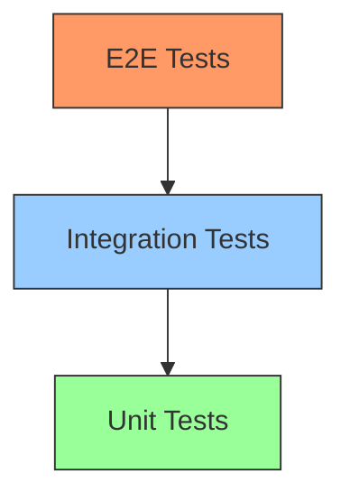

# Testing Strategy

This section covers the testing approach and QA processes.

---

## Contents

| Document | Description |
|----------|-------------|
| [Unit Testing](unit-tests.md) | Unit test guidelines |
| [Integration Tests](integration-tests.md) | API and database tests |
| [E2E Testing](e2e-tests.md) | End-to-end testing |
| [QA Checklist](qa-checklist.md) | Manual QA checklists |

---

## Testing Pyramid

| Level | Coverage | Speed |
|-------|----------|-------|
| Unit | 70% | Fast |
| Integration | 20% | Medium |
| E2E | 10% | Slow |

---

## Test Tools

| Layer | Frontend | Backend |
|-------|----------|---------|
| Unit | Vitest, React Testing Library | JUnit 5, Mockito |
| Integration | - | TestContainers |
| E2E | Playwright | - |
