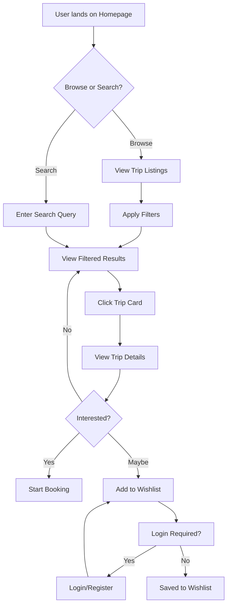
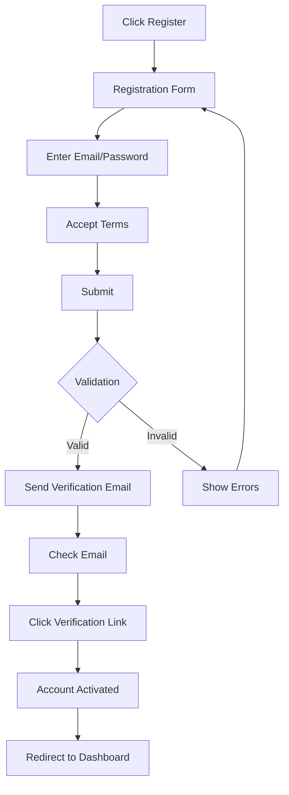
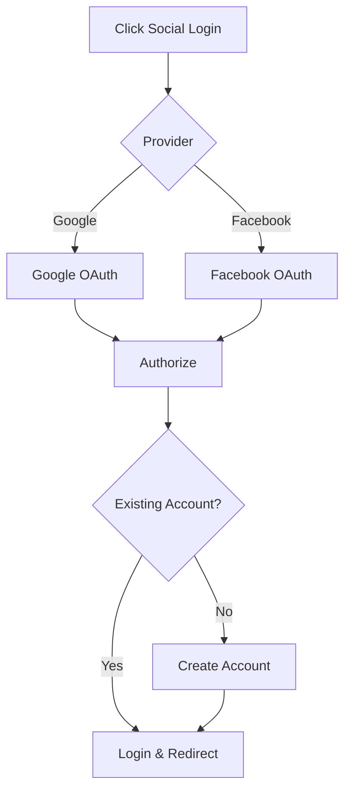
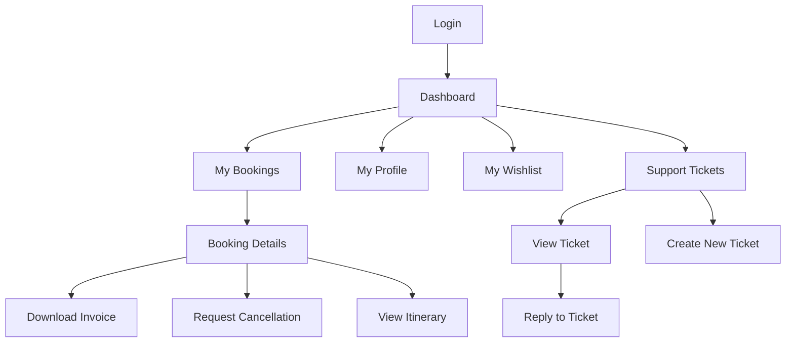
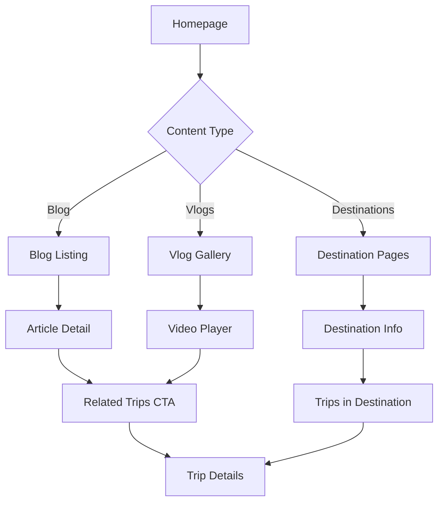
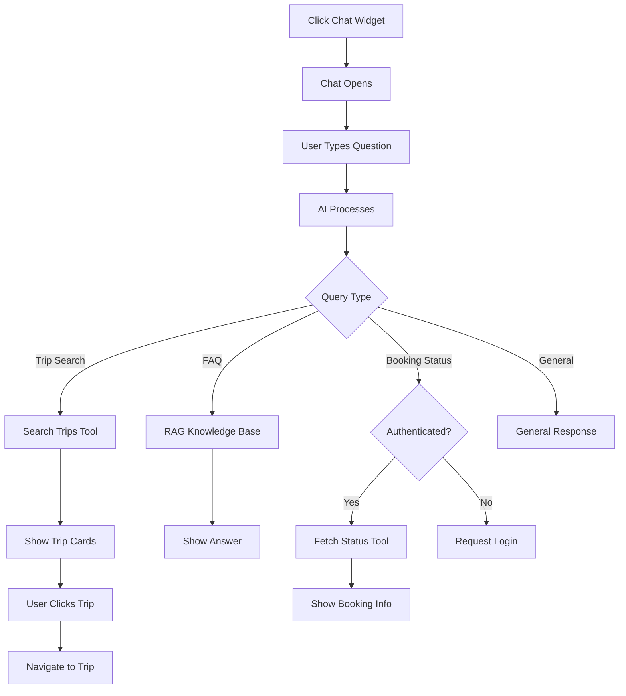
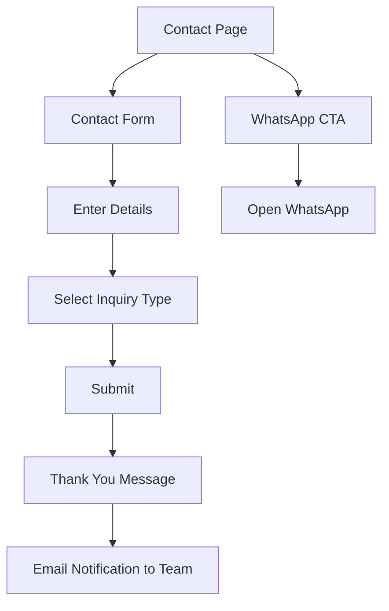
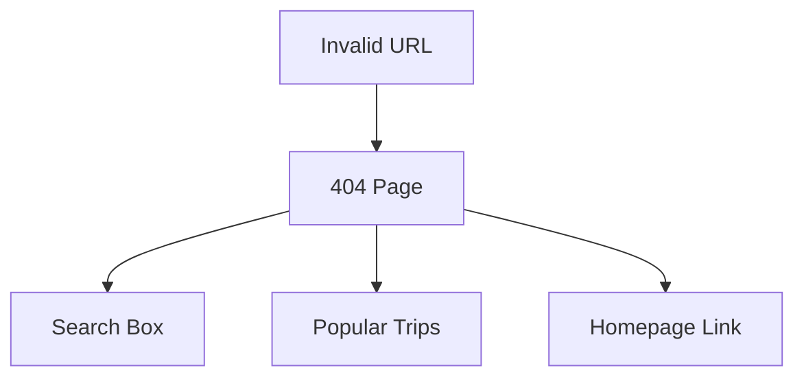
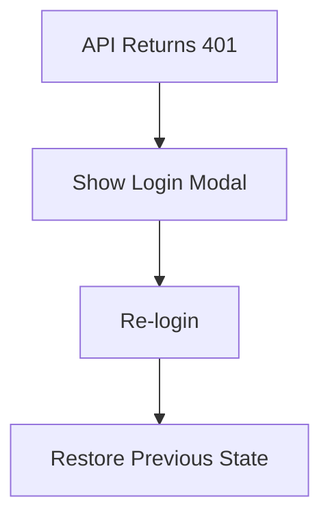

# User Flows

## Overview

This document defines the primary user flows through the Egypt Tours Platform.

---

## Flow 1: Trip Discovery

### Key States

| State | Description | Actions Available |
|-------|-------------|-------------------|
| Listings | Grid/list of trips | Filter, sort, paginate |
| Trip Card | Preview card | View details, quick wishlist |
| Trip Details | Full information | Book, wishlist, share |

---

## Flow 2: User Registration

### Alternative: Social Login

---

## Flow 3: Customer Portal

---

## Flow 4: Content Consumption

---

## Flow 5: AI Assistant

---

## Flow 6: Contact/Lead

---

## Error Handling Flows

### 404 Page

### Session Expired

